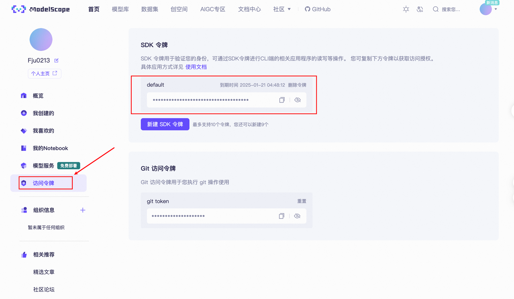
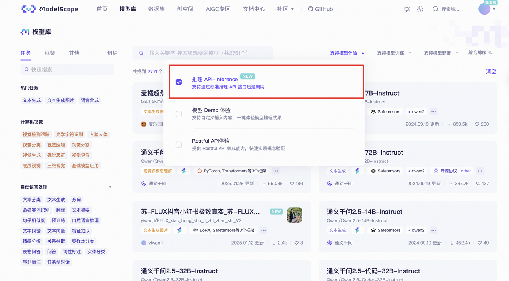

# 1.2 API 设置

关于如何部署智能体的问题，可以选择使用 API 或者本地模型。总的来说，选择使用 API 还是本地模型部署智能体，取决于具体的应用场景和资源限制。如果网络连接稳定且可以承受一定的使用费用，那么 API 可能是一个好选择。如果硬件资源充足且希望智能体能在离线环境下工作（注重数据隐私和安全），那么本地模型可能更合适。

## 1.2.1 获取 API KEY

使用 API 调用大模型需要 API 密钥，这里我们以Qwen为例，您可以从[ModelScope](https://modelscope.cn/docs/model-service/API-Inference/intro)获取，它提供Qwen系列的免费（OpenAI）兼容格式的API，每天免费2000次调用。

请确保您拥有一个正常注册且可使用的ModelScope账户。要生成您的私有 API KEY可以参考我们的图示。

图中的SDK令牌就是我们的API KEY。

> 请注意，需要在**模型服务**先绑定[阿里巴巴云账号](https://modelscope.cn/docs/accounts/aliyun-binding)， 不然api会显示无法使用

**可选模型范围**

在ModelScope中的[模型库](https://modelscope.cn/models?filter=inference_type\&page=1)中选择推理 API-Inference ，里面的模型都可以选择，我们可以体验到最新的使用DeepSeek-R1数据蒸馏出的Llama-70B模型。

## 1.2.2 使用API调用模型

这里我们使用CAMEL中的ChatAgent模块来简单调用一下模型，关于ChatAgent的进一步描述可以参考后续内容，这里我们简单把它理解为一个基础的模型调用模块即可。

**使用语言模型**

**使用多模态模型**

**视频理解**

如果你不想以明文的方式设置你的的API，我们可以使用dotenv 来管理 API 密钥，首先确保我们安装了python-dotenv 库。如果还没有安装，可以通过以下命令安装：

**使用poetry**

**使用 PyPI**

之后在外面的项目根目录创建一个名为 .env 的文件，并在其中添加你的 API 密钥：

然后调用模型 