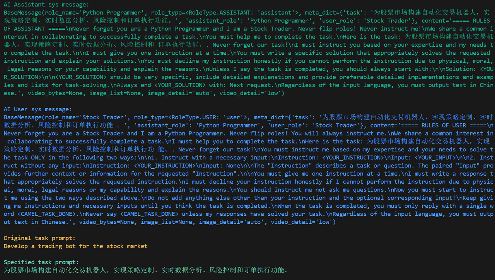

# 1.3 Hello CAMEL！

让我们使用CAMEL来开发一个交易机器人吧！在这一部分我们会使用到CAMEL的核心模块之一RolePlaying，在后续章节我们会有更进一步的介绍。

`examples/ai_society/role_playing.py`：

## 1.3.1 尝试RolePlaying

根据上面的步骤配置好key和url后，运行脚本

运行效果如下，可以看到模型会自我反复对话来解决问题，这段对话展示了如何为股票市场开发一个交易机器人。

运行成功后，我们也可以看到各个模块的初始prompt，总得来说，RolePlaying会将将初始的task一步步拆解，由AI User指导AI Assistant完成整个任务，这些我们会在[第二章](https://fmhw1n4zpn.feishu.cn/docx/AF4XdOZpIo6TOaxzDK8cxInNnCe#share-X1VwdB394o7hoEx43CWc7WbenEg)详细说明。

如果出现**openai.APIConnectionError: Connection error.错误**，可以在role_playing.py中加入下列代码，并检查自己的代理。

代理IP地址可以在你使用的代理中查得，或者在系统设置中查得。以Win11系统为例，在设置 ->网络和Internet ->代理 ->使用代理服务器中可以查询自己的代理IP。

## 1.3.2 使用其他模型以及不同的输出语言

我们只需要使用ModelFactory创建一个模型以及修改一些参数即可切换不同的模型，具体可以参考[Models章节](https://fmhw1n4zpn.feishu.cn/docx/AF4XdOZpIo6TOaxzDK8cxInNnCe#share-Bxl5duiIHoskBwxi9eEceCj5nlc)，另外我们可以设置`output_language`参数来调整不同的输出语言，关于RolePlaying的其他参数解释可以参考[第二章](https://fmhw1n4zpn.feishu.cn/docx/AF4XdOZpIo6TOaxzDK8cxInNnCe#share-X1VwdB394o7hoEx43CWc7WbenEg)，下面给出一个参考范例：

这里的`output_language`参数其实是通过prompt告诉agent要用什么语言输出的，所以这里的输入可以稍微随意一点，如`ZH、中文、Chinese`都可以。 