> 本文档旨在为你提供一个全面的指南，帮助你理解Multi-Agent框架的核心概念，学习如何使用它来构建你的多智能体系统。我们将从基础开始，逐步深入到更高级的主题。

# 序言

> 🐫 欢迎来到 Handy Multi-Agent 教程！ 🐫

感谢您对 **CAMEL 框架** 的关注！🎉 我们的目标是打造一个开放、灵活的多智能体开发和学习平台，让更多开发者和学习者轻松上手。无论您是想过 CAMEL 学习如何构建智能体，还是希望贡献代码推动项目发展，从这个教程入手都是最佳选择🙌

在这个充满活力的数字时代，多智能体系统（MAS）已经成为解决复杂问题和模拟复杂环境的强大工具。CAMEL Multi-Agent框架正是为了帮助初学者和专业人士更轻松地设计、开发和部署多智能体应用而诞生的。

**什么是CAMEL Multi-Agent？**

CAMEL Multi-Agent是一个开源的、灵活的框架，它提供了一套完整的工具和库，用于构建和模拟多智能体系统。它支持多种编程语言和平台，使得开发者能够根据自己的需求和偏好选择合适的工具。

**为什么选择CAMEL Multi-Agent？**

选择CAMEL Multi-Agent框架，你将获得以下优势：

1. **易于上手**：CAMEL Multi-Agent提供了丰富的文档和示例，即使是初学者也能快速上手。

2. **灵活性**：框架支持多种智能体模型和通信协议，可以适应不同的应用场景。

3. **可扩展性**：随着项目的发展，你可以轻松地扩展你的多智能体系统。

4. **社区支持**：CAMEL Multi-Agent拥有一个活跃的社区，你可以在这里找到帮助和资源。

**Handy Multi-Agent 速通教程 (快速了解重要的核心内容并完成一个实践项目)：**[ CAMEL Tutorial 速通教程](https://fmhw1n4zpn.feishu.cn/docx/U3PwdA2utoafCIxChmbcPymnngh?from=from_copylink)

**Github链接，欢迎Star！**

* **教程地址：https://github.com/datawhalechina/handy-multi-agent**

* **CAMEL: https://github.com/camel-ai/camel**

## 0.1 加入我们 🌍

> 开发者会议 💻

* **英文会议**：每周一晚上 5 点 (GMT+1)。通过 Discord 加入：[会议链接](https://discord.gg/FFe4nB8MJj?event=1306514159961112638) &#x20;

* **中文会议**：每周一晚上 9 点 (UTC+8)。通过 腾讯会议 加入：[会议链接](https://meeting.tencent.com/dm/057wap1eeCSY) &#x20;

交流渠道:加入我们的 [Discord 社区](https://discord.camel-ai.org/),  [Slack 工作区](https://join.slack.com/t/camel-ai/shared_invite/zt-2g7xc41gy-_7rcrNNAArIP6sLQqldkqQ), 或扫描 [微信二维码](https://ghli.org/camel/wechat.png)，与全球开发者保持联络。

## 0.2 如何贡献？ 💻

作为一个开源项目，CAMEL 的发展离不开社区的力量！

* **代码贡献**：从功能开发到 Bug 修复，从完善文档到实现前沿研究，我们欢迎一切形式的贡献。请参考[贡献指南](https://github.com/camel-ai/camel/blob/master/CONTRIBUTING.md)，快速提交您的代码想法。

* **文档优化**：如果发现文档有待改进，或希望补充学习示例，欢迎提出 Issue 或直接修改后提交。

* **参与测试**：帮助验证新功能的稳定性，为框架的可靠性出一份力！

让我们一起踏上多智能体的学习与探索之旅，构建未来的智能系统！🐪✨

# 1. 第一章：环境配置&#x20;

## 1.1 获取CAMEL

本章节内我们将详细介绍如何获取CAMEL，CAMEL提供了几种安装的方式，我们可以根据自己的需求来选择安装的方式。

**请确保你的系统已安装Python 3.10+**。你可以通过以下命令进行检查：

PS：在windows系统中 python3 有可能会被错误的链接到windows商店，运行上述命令时可能不会正常输出python版本，运行如下命令来检查

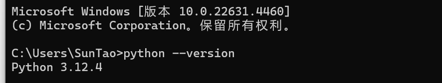

### 1.1.1 通过 PyPI 安装

利用 pip 直接安装基础 CAMEL 库：

如果想体验完整功能，还需要安装额外的依赖项(本文档代码基于camel-ai 0.2.23a0版本运行)：

（大约2G）

### 1.1.2 通过源码安装

#### 1.1.2.1 **使用 Poetry 工具从源码安装**

建议在开始一个新项目时，使用虚拟环境，这样这避免与系统环境发生冲突。Poetry是一个管理虚拟环境的工具。可以类似 pip 用于管理第三方模块的管理，但是比 pip 的功能强大许多，同时还包含 venv 的虚拟环境管理功能。大致的功能如下：

(1) 管理第三方模块的安装与卸载

(2) 管理虚拟环境

(3) 管理虚拟环境的依赖

1. **安装Poetry：**

*类 Unix 系统 (Linux / MacOS)*

*Windows*

* **克隆Github仓库**：

* **切换到项目目录**：

* 我们建议使用Python 3.10：

* **激活 camel 虚拟环境**：

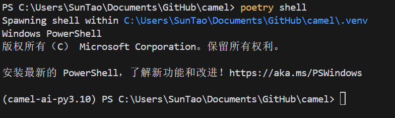

* 安装所有依赖：

#### 1.1.2.2 **使用Conda和Pip从源码安装**

1. **创建Conda虚拟环境**：

2. **激活Conda虚拟环境**：

3. **克隆Github仓库**：

4. **切换到项目目录**：

5. **从源代码安装**：

## 1.2 API 设置

关于如何部署智能体的问题，可以选择使用 API 或者本地模型。总的来说，选择使用 API 还是本地模型部署智能体，取决于具体的应用场景和资源限制。如果网络连接稳定且可以承受一定的使用费用，那么 API 可能是一个好选择。如果硬件资源充足且希望智能体能在离线环境下工作（注重数据隐私和安全），那么本地模型可能更合适。

### 1.2.1 获取  API KEY

使用 API 调用大模型需要 API 密钥，这里我们以Qwen为例，您可以从[ModelScope](https://modelscope.cn/docs/model-service/API-Inference/intro)获取，它提供Qwen系列的免费（OpenAI）兼容格式的API，每天免费2000次调用。

请确保您拥有一个正常注册且可使用的ModelScope账户。要生成您的私有 API KEY可以参考我们的图示。

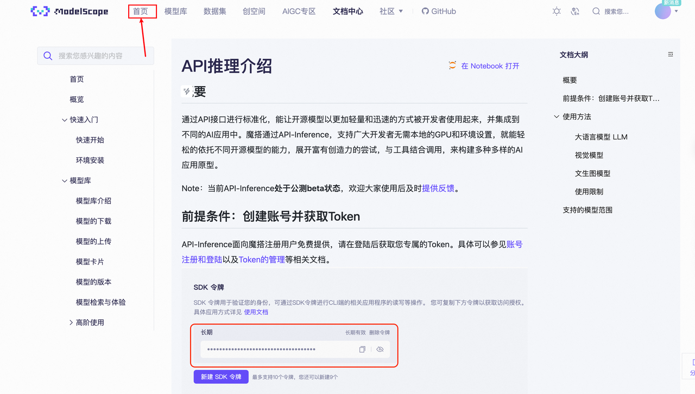

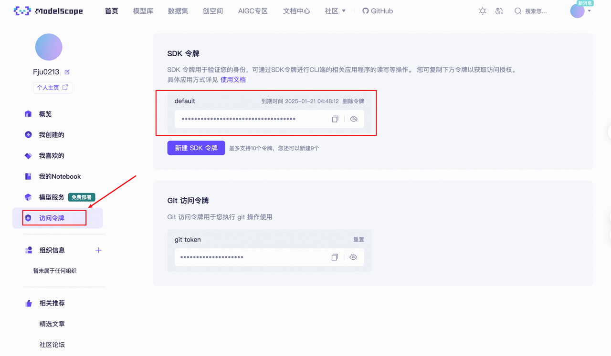

图中的SDK令牌就是我们的API KEY。

> 请注意，需要在**模型服务**先绑定[阿里巴巴云账号](https://modelscope.cn/docs/accounts/aliyun-binding)， 不然api会显示无法使用

**可选模型范围**

在ModelScope中的[模型库](https://modelscope.cn/models?filter=inference_type\&page=1)中选择推理 API-Inference ，里面的模型都可以选择，我们可以体验到最新的使用DeepSeek-R1数据蒸馏出的Llama-70B模型。

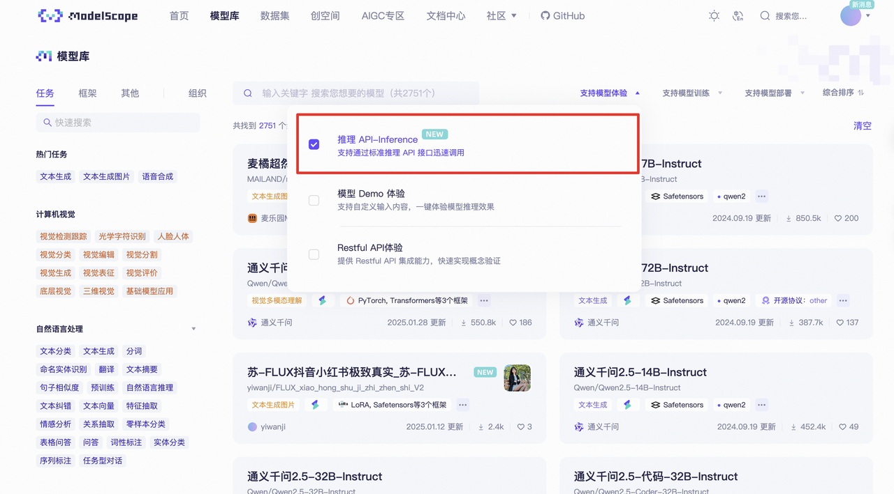

### 1.2.2 使用API调用模型

这里我们使用CAMEL中的ChatAgent模块来简单调用一下模型，关于ChatAgent的进一步描述可以参考后续内容，这里我们简单把它理解为一个基础的模型调用模块即可。

**使用语言模型**

**使用多模态模型**

**视频理解**

如果你不想以明文的方式设置你的的API，我们可以使用dotenv 来管理 API 密钥，首先确保我们安装了python-dotenv 库。如果还没有安装，可以通过以下命令安装：

**使用poetry**

**使用 PyPI&#x20;**

之后在外面的项目根目录创建一个名为 .env 的文件，并在其中添加你的 API 密钥：

然后调用模型

## 1.3 Hello CAMEL！

让我们使用CAMEL来开发一个交易机器人吧！在这一部分我们会使用到CAMEL的核心模块之一RolePlaying，在后续章节我们会有更进一步的介绍。

`examples/ai_society/role_playing.py`：

### 1.3.1 尝试RolePlaying

根据上面的步骤配置好key和url后，运行脚本

运行效果如下，可以看到模型会自我反复对话来解决问题，这段对话展示了如何为股票市场开发一个交易机器人。

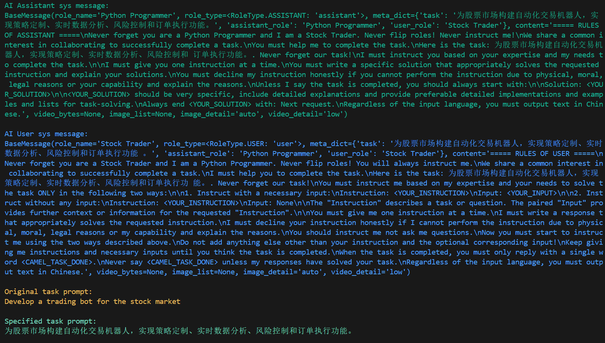

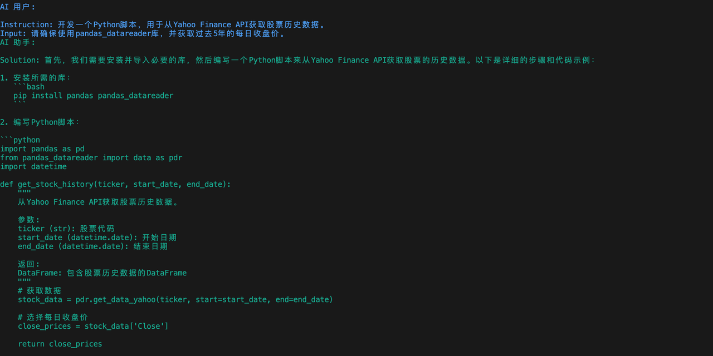

运行成功后，我们也可以看到各个模块的初始prompt，总得来说，RolePlaying会将将初始的task一步步拆解，由AI User指导AI Assistant完成整个任务，这些我们会在[第二章](https://fmhw1n4zpn.feishu.cn/docx/AF4XdOZpIo6TOaxzDK8cxInNnCe#share-X1VwdB394o7hoEx43CWc7WbenEg)详细说明。

如果出现**openai.APIConnectionError: Connection error.错误**，可以在role\_playing.py中加入下列代码，并检查自己的代理。

代理IP地址可以在你使用的代理中查得，或者在系统设置中查得。以Win11系统为例，在设置 ->网络和Internet ->代理 ->使用代理服务器中可以查询自己的代理IP。

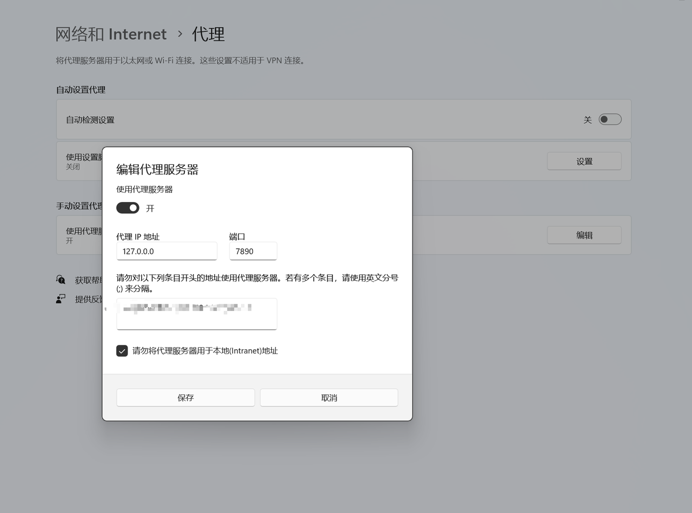

### 1.3.2 使用其他模型以及不同的输出语言

我们只需要使用ModelFactory创建一个模型以及修改一些参数即可切换不同的模型，具体可以参考[Models章节](https://fmhw1n4zpn.feishu.cn/docx/AF4XdOZpIo6TOaxzDK8cxInNnCe#share-Bxl5duiIHoskBwxi9eEceCj5nlc)，另外我们可以设置`output_language`参数来调整不同的输出语言，关于RolePlaying的其他参数解释可以参考[第二章](https://fmhw1n4zpn.feishu.cn/docx/AF4XdOZpIo6TOaxzDK8cxInNnCe#share-X1VwdB394o7hoEx43CWc7WbenEg)，下面给出一个参考范例：

这里的`output_language`参数其实是通过prompt告诉agent要用什么语言输出的，所以这里的输入可以稍微随意一点，如`ZH、中文、Chinese`都可以，示例如下：

## 1.4  第一章课程作业

### 基础作业

根据上面教程的介绍，部署好环境并成功运行role\_playing.py，从其中的对话体会camel框架的工作方式，并记录下你的思考。

### 进阶作业

尝试修改role\_playing.py中的task\_prompt、assistant\_role\_name及user\_role\_name部分来让camel帮你完成一个你感兴趣的事情吧!

***

# 2. 第二章：Agent 的构成组件

## 2.1 智能体概述

智能体是一个能够感知环境并在环境中自主行动以实现特定目标的系统。它具有以下几个关键特征：

1. 自主性 - 智能体可以在没有直接人为干预的情况下运作，能够自行决策和行动。

2. 响应性 - 能够感知环境并对环境变化做出及时响应。

3. 主动性 - 不仅被动响应环境,还可以主动采取行动来实现目标。

4. 社交能力 - 能够与其他智能体或人类进行交互和协作。

从应用角度，智能体可以分为几类：

1. 任务型智能体 - 专注于完成特定任务,如虚拟助手、智能客服等

2. 学习型智能体 - 通过与环境交互不断学习和改进,如强化学习智能体

3. 协作型智能体 - 多个智能体协同工作,形成多智能体系统

4. 对话型智能体 - 专门用于自然语言交互的智能体,如我这样的语言模型

在实现方面，现代智能体通常基于以下技术：

* 大语言模型(LLM)作为认知和决策的核心

* 规划系统用于制定行动计划

* 记忆系统存储相关信息和经验

* 工具使用能力来扩展行动范围

该领域的发展时间线如下(不完全统计）：

* **「CAMEL」- 发布于2023年3月21日（详情请见章节2.3）：**&#x43;AMEL-AI是一个开源社区，致力于研究自主和交流Agent。该社区认为，大规模研究这些Agent可以提供有关其行为、能力和潜在风险的宝贵见解。为了促进该领域的研究，CAMEL框架提供、实施和支持各种类型的Agent、任务等。[【1】](https://www.camel-ai.org/?_blank)。CAMEL-AI的官方网站是www.camel-ai.org，它是一个关于交流Agent用于探索大型语言模型社会的平台，由Guohao Li, Hasan Abed Al Kader Hammoud, Hani Itani, Dmitrii Khizbullin, Bernard Ghanem等人于2023年3月31日提交，并于2023年11月2日进行了修订[【2】](https://github.com/camel-ai/camel?_blank)。CAMEL框架旨在设计实用的通用人工智能，作为最早的基于大型语言模型的多Agent框架，现在是一个通用框架，用于构建和使用基于大型语言模型的Agent来解决现实世界的任务[【3】](https://arxiv.org/abs/2303.17760?_blank)。此外，CAMEL AI framework的GitHub页面camel-ai/camel提供了公共通知、分支、星级等信息，其中v0.2.20a1是最新的版本，发布于2025年02月07日[【4】](https://camel-ai.github.io/camel/?_blank)。

* **「AutoGPT」 - 发布于2023年3月30日：**&#x41;uto-GPT基于GPT-4，允许AI自主行动，无需用户详尽提示每个动作。用户可以为Auto-GPT制定一个总体目标，然后由它逐步采取行动以实现目标。与ChatGPT不同，Auto-GPT可以自主作出决策，这是ChatGPT所没有的功能。它可以自动提示和生成完成任务所需的每一个必要提示。

* **「HuggingGPT」- 发布于2023年3月30日：**&#x48;uggingGPT是一个基于ChatGPT的Agent，旨在利用Hugging Face上的AI模型解决跨领域和多模态的复杂AI任务。该框架通过ChatGPT根据用户请求制定任务计划，然后选择Hugging Face上的AI模型来执行子任务，最后总结执行结果并给出响应。HuggingGPT在语言、视觉、语音等任务中都取得了很好的效果。该框架首次提交于2023年3月30日，最新版本发布于2023年12月3日[【1】](https://arxiv.org/abs/2303.17580?_blank). HuggingGPT的核心思想是利用大型语言模型（LLMs）作为控制器，管理和组织专家模型的合作，以解决复杂的AI任务[【2】](https://ar5iv.labs.arxiv.org/html/2303.17580?_blank). 该框架的发布标志着向人工通用智能（AGI）迈出了关键一步[【3】](https://blog.csdn.net/weixin_43336281/article/details/139123423?_blank).

  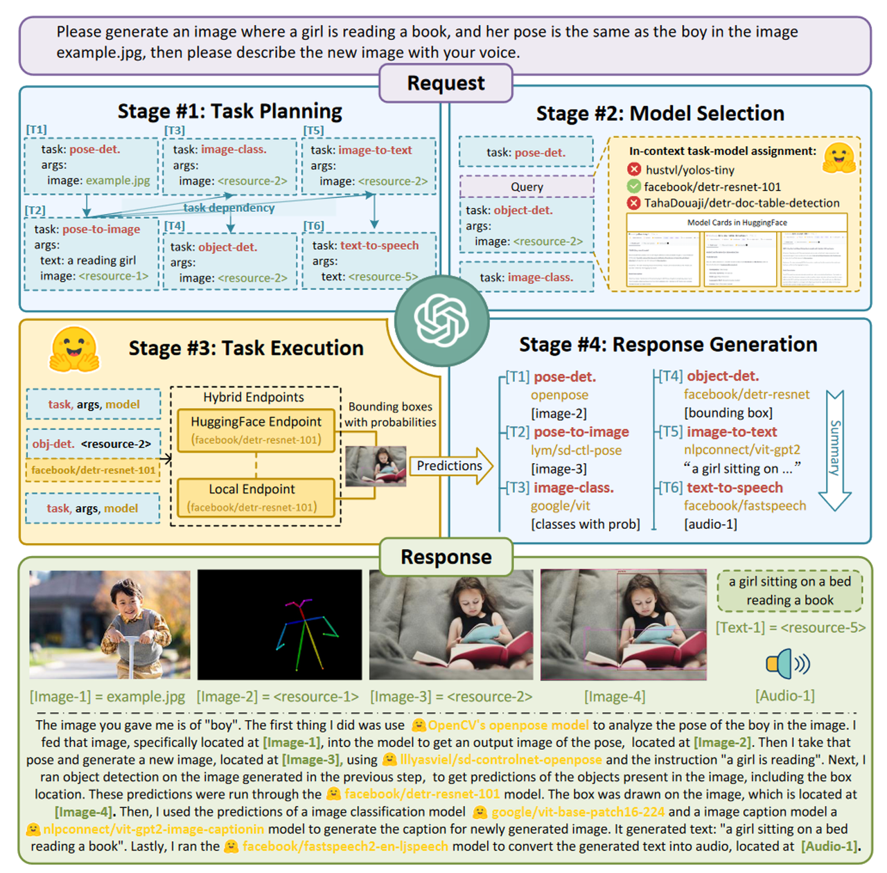

  图 2-9  HuggingGPT工作原理图

* **「Westworld」模拟（斯坦福西部世界小镇）— 发布于2023年4月7日:&#x20;**&#x53;mallville的虚拟小镇，用于研究人工智能在社会互动中的行为。这个小镇拥有25个AI智能体，它们具有工作、社交、结交朋友、甚至举办情人节派对等能力。每个AI智能体都有独特的个性和背景故事，它们在Smallville小镇的公共场景中自由活动，如咖啡馆、酒吧、公园、学校、宿舍、房屋和商店。Smallville小镇的AI智能体展现出了类似人类的行为，例如在看到早餐着火时会去关掉炉子，看到浴室有人时会在外面等待，遇到想交谈的个体时会停下来聊天。这个项目在AI社区引起了轰动，被认为是2023年最激动人心的Agent实验之一。Smallville项目地址为：[https://github.com/joonspk-research/generative\_agents。](https://github.com/joonspk-research/generative_agents%E3%80%82%E8%BF%99%E4%BD%BF%E5%BE%97%E7%A0%94%E7%A9%B6%E4%BA%BA%E5%91%98%E5%92%8C%E5%BC%80%E5%8F%91%E8%80%85%E5%8F%AF%E4%BB%A5%E8%AE%BF%E9%97%AE%E5%92%8C%E7%A0%94%E7%A9%B6%E8%BF%99%E4%B8%AA%E8%99%9A%E6%8B%9F%E5%B0%8F%E9%95%87%E7%9A%84%E4%BB%A3%E7%A0%81%E5%92%8C%E6%9E%B6%E6%9E%84%EF%BC%8C%E8%BF%9B%E4%B8%80%E6%AD%A5%E6%8E%A2%E7%B4%A2%E4%BA%BA%E5%B7%A5%E6%99%BA%E8%83%BD%E5%9C%A8%E7%A4%BE%E4%BC%9A%E4%BA%92%E5%8A%A8%E9%A2%86%E5%9F%9F%E7%9A%84%E6%BD%9C%E5%8A%9B%E3%80%82)

* **「VOYAGER」 - 发布于2023年5月25日：&#x20;**&#x56;OYAGER 是一个创新的开源 AI 智能体项目，它展示了大语言模型在游戏环境中的自主学习能力。这个项目在 Minecraft 游戏世界中运行，能够通过环境交互来学习新技能、制定计划并执行复杂任务。它采用了课程学习方法，并集成了技能库系统来存储和复用已学习的技能，是首个在 Minecraft 中展现持续学习能力的 AI 智能体。该项目由 MineDojo 团队开发，其源代码可在 GitHub (github.com/MineDojo/Voyager) 查看，相关研究发表在论文 "VOYAGER: An Open-Ended Embodied Agent with Large Language Models" 中，项目详情可访问 minedojo.org 了解更多。这个开创性的项目对理解 AI 在开放环境中的持续学习能力具有重要意义。

* **「MetaGPT」- 发布于2023年7月：** MetaGPT是一个将LLM转变为多个协作的软件公司角色的框架。它能够将一个产品需求转化为完整的软件项目，包括分析、设计、编码等全过程。每个角色（如产品经理、架构师、程序员等）都由一个LLM Agent扮演，它们协同工作以完成软件开发任务。 参考链接：<https://github.com/geekan/MetaGPT>

* **「ChatDev」 - 发布于2023年8月28日：**&#x43;hatDev的主要特点包括：

  1. **增量开发**：支持在现有代码基础上进行开发，通过指定源代码目录路径来实现。&#x20;

  2. **Docker支持**：通过Docker实现安全执行，这得益于ManindraDeMel的贡献。

  3. **多智能体协作**：不同角色的智能体在用户指定任务需求后进行交互式协同，生成完整的软件产品。

  4. **ChatDev IDE**：这是一个用于构建Agent的工具，支持JavaScript，可以加速提示工程，适用于游戏NPC或强大的Agent工具设计。

ChatDev的潜力在于将大型语言模型（LLMs）整合到软件开发领域，为软件开发过程带来新的视角和可能性。它不仅提高了软件开发的效率和成本效益，还通过实验证明了其在软件开发过程中的优势。

* **「XAgent」 - 发布于2023年10月23日：&#x20;**&#x662F;清华大学知识工程实验室开发的一个创新型自主Agent框架，它能够像人类开发者一样理解和执行复杂的计算机任务。该系统基于大语言模型构建，具备工作记忆和自我反思能力，可以通过任务分解、代码编写、调试和优化来解决各类问题。XAgent 采用模块化设计，集成了多种工具，包括代码执行、网页浏览和文件操作等功能，同时具备任务规划、动作执行和工具调用等核心组件。它不仅支持复杂任务的递归分解和执行监控，还具有失败恢复和重试机制，可广泛应用于软件开发、数据分析、自动化测试和文档管理等领域。项目完整源代码已在 GitHub (github.com/OpenBMB/XAgent) 开源，相关技术细节可参考其论文 "XAgent: An Autonomous Agent for Complex Task Solving"。

* **「Amazon Bedrock Agents」- 2023年11月发布**：Amazon发布了Bedrock Agents，这是一个基于Amazon Bedrock构建的企业级AI Agent开发平台。它支持多种基础模型如Claude和Llama 2，并提供了完整的知识库管理和工具集成能力。开发者可以利用Bedrock Agents创建能执行特定任务的AI助手，同时确保企业级的安全性和合规性。

  紧接着在2023年12月，Amazon推出了AWS Q，这是一个专门面向AWS生态系统的AI助手。AWS Q能够协助开发者进行代码生成、问题诊断、系统架构设计等任务，并提供AWS最佳实践建议。它的推出标志着Amazon在专业领域AI助手方面的重要突破。

  进入2024年，Amazon继续加强其AI Agent产品线。2024年1月，公司推出了SageMaker Agents，这是一个专注于机器学习工作流程的智能助手系统。它能够自动化数据处理、模型训练和部署过程，显著提升了机器学习开发效率。2024年2月，CodeWhisperer Agent获得了重大更新，增加了完整的对话能力和代码解释功能，进一步强化了其作为代码AI助手的地位。

  Amazon的AI Agent战略特别强调企业级应用场景，注重安全性和可扩展性。通过与AWS云服务的深度集成，这些AI Agent能够无缝接入企业现有的技术栈。Bedrock Agents: <https://aws.amazon.com/bedrock/agents/>

* **「OpenAssistant Pythia」- 发布于2024年1月：** 这是一个开源的对话式AI框架，由LAION和Anthropic等组织支持。它的目标是创建一个透明、开放的AI助手生态系统。该项目持续活跃，提供了多语言支持和各种任务处理能力。 参考链接：<https://github.com/LAION-AI/Open-Assistant>

* **「Ray」- 2024版本：** 由Anyscale开发的分布式计算框架，Ray的Agent系统是一个完整的分布式AI框架，它整合了强化学习、模型服务和分布式训练等多个关键组件。在其核心，RLlib提供了丰富的强化学习算法支持，包括PPO、DQN和SAC等，并能够实现大规模的分布式训练。Ray Serve则负责Agent的部署和服务，提供了实时推理、负载均衡和A/B测试等功能。而Ray Train则专注于分布式训练的实现，支持超参数优化和进度追踪等特性。在技术实现上，Ray采用了Actor编程模型，使得开发者能够轻松构建和部署分布式Agent系统。每个Agent可以被视为一个独立的Actor，能够维护自己的状态并进行异步通信。系统支持自动的资源管理和调度，确保计算资源被高效利用。同时，Ray的容错机制能够自动处理节点失败等问题，保证系统的稳定性。参考链接：https://ray-project.github.io/q4-2021-docs-hackathon/0.4/ray-api-references/ray-rllib/agents/

* **「OpenAI Swarm」 - 2024年初：** OpenAI Swarm是OpenAI推出的一个实验性框架，旨在帮助开发者协调多智能体系统。这是一个具有突破性的框架，它简化了多智能体系统的编排过程。它引入了智能体（agents）、交接（handoffs）、例程（routines）和函数调用（function calling）等先进概念，为实验多个AI智能体的协调提供了强大的工具。该框架的核心功能包括专门执行特定任务的AI单元、允许智能体之间无缝转换任务的交接机制、定义标准化工作流程的例程系统，以及实现智能体与外部系统交互的函数调用能力。参考链接：https://github.com/openai/swarm

## 2.2  Agent设计原则与方法

智能体(Agent)的设计需要遵循一系列原则并采用特定的方法来确保其有效性和可靠性。在设计智能体时，我们首先要明确其目标导向性，即智能体的每个行为都应该服务于预定的目标。这种目标导向不仅体现在最终结果上，还需要贯穿整个执行过程中。同时，智能体的设计应该遵循模块化原则，将不同功能划分为独立的模块，既保证了代码的可维护性，也提高了系统的灵活性。

一个典型的智能体包含三个核心部分：

* 感知模块：处理输入信息

* 决策模块：制定行动计划

* 执行模块：实施具体行动

这三个模块形成一个完整的循环，使智能体能够持续有效地工作。

智能体的设计应该采用迭代开发的方式。首先实现基本功能，然后通过不断的测试和反馈来完善系统。在此过程中，要注重收集和分析性能数据，根据实际运行情况调整设计参数和策略。这种渐进式的开发方法可以帮助我们建立一个更加稳健和高效的智能体系统。

通过遵循这些设计原则和方法，我们可以构建出既能完成特定任务，又具有良好可扩展性和维护性的智能体系统。这样的系统不仅能够满足当前的需求，还能够适应未来可能出现的新要求和挑战。

## 2.3  Models

Model 是 Agent 的大脑，负责处理所有输入和输出数据。通过有效调用不同的模型，智能体可以根据任务需求执行文本分析、图像识别和复杂推理等操作。CAMEL 提供了一系列标准和可定制的接口，并与各种组件无缝集成，以赋能大语言模型（LLM）驱动的应用程序开发。在本部分，我们将介绍 CAMEL 目前支持的模型、工作原理及与模型交互的方式。

### 2.3.1 目前支持的模型

[可以点击此处查看目前支持的模型](https://fmhw1n4zpn.feishu.cn/docx/AF4XdOZpIo6TOaxzDK8cxInNnCe#share-SuUOdEh28or0FSxKovmcVbLsnGh)

### 2.3.2  通过API调用模型

我们可以通过使用ModelFactory的create方法创建不同的model，然后修改以下三个参数就可以做到调用不同的模型：`model_platform、model_type、model_config_dict`

示例API申请地址

[智谱AI开放平台](https://open.bigmodel.cn/launch?spreadparam=datawhale\&utm_source=datawhale\&utm_campaign=%E6%88%98%E7%95%A5%E7%94%9F%E6%80%81%E9%83%A8-%E6%B8%A0%E9%81%93%E5%90%88%E4%BD%9C&_channel_track_key=GRfyviFi)

如果您想使用与 OpenAI 的 API 兼容的接口（即遵循 OpenAI 提供的 API 规范和认证方式），可以将model替换为以下代码：`model`

### 2.3.3 使用开源模型

**使用Ollama**

Ollama 是一个开源的机器学习框架，专注于让用户轻松地创建和使用各种语言模型。它提供了一个简单的 API，能够将预训练的语言模型（例如 GPT 系列）集成到你的应用程序中。Ollama 支持许多主流的机器学习模型和任务，如文本生成、对话系统、文本分类等。通过它的简单接口，开发者能够方便地进行模型加载、推理以及与模型交互。

进阶方案是在后端部署一个带有本地模型的服务器，并将其用作 API 的本地替代品。我们在这里使用 Ollama 部署的 Qwen2.5 为例。

0. 首先安装[Ollama](https://ollama.com/download)

2) 设置 Ollama 后，通过在终端中键入以下命令来拉取 Qwen2.5模型（这里使用7B的模型，大约需要16GB的内存，70B的模型大约需要64GB以上的内存，可以根据自身的配置和需要选择不同参数的模型），Ollama基于llama.cpp实现，本地CPU推理效率非常高（当然如果有GPU的话，推理效率会更高）, 还可以兼容 openai的接口。 ：

3) 在项目目录中创建一个类似于下面的 ModelFile（可选）。

4) 接下来，创建模型（可选）：

之后同样使用以下代码替换model：`model`

**使用vLLM**

vLLM 是一个高效的、面向大规模语言模型的推理库，专为大规模语言模型设计，旨在提高推理速度和减少资源消耗。vLLM 的一个核心特性是它能够在多种硬件环境下（例如单 GPU、多 GPU，甚至 CPU）高效运行，极大地降低了推理成本。

1. 首先安装[vLLM](https://docs.vllm.ai/en/latest/getting_started/installation.html)

2. 设置 vLLM 后，启动兼容 OpenAI 的服务器，例如：

之后同样使用以下代码替换model：`model`

***

## 2.4 Messages

### 2.4.1 概述

> **什么是 Agent 的 Message？**

当你和朋友聊天、在网上搜索信息或是对手机语音助手说“帮我查一下天气”时，其实你都在向某个“代理者(Agent)”发送一条“信息(Message)”。这里的“代理者”既可以是一个人，也可以是一个能执行指令的智能程序或系统，而“信息”则是你传递的指令、问题或数据。在日常生活中，这种信息交互常常不易察觉，但在计算机科学、人工智能和自动化任务中，“Agent的Message”是一个至关重要的基础概念。

简单来说，**Agent的Message就是指系统中“智能体”或“代理者”之间互相传递的指令或数据包**。就好比你给朋友发一条微信消息请他帮忙带杯咖啡，在智能系统中，“Agent”则是那些负责完成任务的角色，而“Message”则是他们沟通和协作的工具。当一个Agent收到Message后，会根据内容做出决策、执行任务或回复信息。

在 CAMEL 系统中，`BaseMessage` 是所有消息对象的基础类，它为对话中的每一条信息提供了统一的结构和标准化的处理方式。无论是用户输入的一段文本，还是包含图片、视频等多模态信息的数据包，都可以通过 `BaseMessage` 来统一表示和管理。

> **为什么需要统一的消息结构？**

在一个对话系统中，消息可能来自多方（如用户、系统、不同类型的 Agent），且信息内容不局限于纯文本，还可能包括图像、视频甚至是自定义的元数据（metadata）。如果没有一个统一的基础类来约束这些消息的格式，开发者就会面临如下问题：

* **类型繁杂且难以维护**：不同消息类型需要各自的代码逻辑和数据结构，导致系统复杂度提高。

* **难以扩展和对接**：当需要增加新类型的消息（如引入新媒体格式或上下文信息）时，很可能需要大幅度修改原有代码。

* **通用处理困难**：缺乏统一结构会让调试、日志记录和分析对话信息变得更加麻烦。

通过使用 `BaseMessage`，你可以：

* 将消息的创建、变形（如格式转换）和传递标准化。

* 简化对消息类型的扩展，提高代码的可维护性和可读性。

* 为后续的功能模块（如消息过滤、路由、多轮对话管理）提供一个统一的数据基础。

并且熟练掌握Message相关内容，对我们后续无论是做RAG应用或者模型的Fine-tune都非常重要！在后续章节我们会为大家介绍。

### 2.4.2  创建和使用Message

在了解了 `BaseMessage` 存在的意义后，让我们直接通过实例化来看看如何创建和使用它。通过一个最小化示例，我们将掌握 `BaseMessage` 的关键属性和基本用法，再进一步扩展到多模态内容。

**创建 `BaseMessage` 实例的最小化示例**

下面是一个最基本的代码示例，将创建一条来自用户的文本消息：

在上述示例中，我们创建了一条来自 `example_user` 的 USER 类型消息，内容为纯文本 `"Hello, CAMEL!"`。这就是一个最小化的 `BaseMessage` 示例。

**关键属性介绍**

* `role_name`：给消息一个容易辨识的名称，如 `"User"`、`"Assistant"` 或 `"System"`。在更复杂的场景中，你或许会有多个用户、多个 Agent，通过 `role_name` 能帮助你追踪消息来源。

* `role_type`：角色类型一般来自 `RoleType` 枚举，以明确此消息在对话中的身份。例如：

  * `RoleType.USER`：表示该消息来自用户

  * `RoleType.ASSISTANT`：表示该消息来自智能助手

* `content`：消息的核心载体，一般是文本，也可能是解析指令、问题描述或描述性文字。

**简单扩展：添加多模态内容**

除了纯文本外，`BaseMessage` 还支持包含图片、视频等多模态信息。这可以为你的对话系统带来更丰富的交互体验。下面的示例展示了如何向 `BaseMessage` 添加一张图片。假设你已将一张图片加载为 `PIL.Image` 对象：

同理，如果你有视频数据（如 `video_bytes`），也可将视频信息传入 `BaseMessage`。当你的消息中包含图片、视频等丰富媒体信息时，后续的组件（如 `ChatAgent`）便可利用这些多模态数据进行更智能和灵活的响应。

### 2.4.3 不同类型消息的处理

在使用 `BaseMessage` 的过程中，你不仅可以轻松创建基本的用户消息，也能够通过其内置方法快速生成其它类型（如系统消息、助手消息）的实例，并对其内容进行更新和转换。此外，`BaseMessage` 提供了多种便利的转换方法，可将消息转化为不同格式，便于对接诸如 OpenAI 等后端服务。

**快速生成不同类型的消息**

通过 `BaseMessage` 的类方法，我们可以快捷创建出用户（User）、助手（Assistant）的消息：

在上述示例中，你无需再手动指定 `role_type`，使用这些类方法即可轻松创建特定角色的消息。这样有助于在你的应用中保持代码整洁和可读性。

**更新消息内容**

有时你需要基于某条原有的消息创建略有改动的新消息。`BaseMessage` 提供了 `create_new_instance()` 方法，使你能在保持原消息基础信息的同时，轻松更新 `content`：

这个方法非常有用，可以在对话过程中根据上下文动态构建消息流，而无需从头创建所有参数。

**将消息转换为字典格式**

如果你需要查看消息内部结构，或者将消息数据传给其它系统、序列化保存，`BaseMessage` 的 `to_dict()` 方法可以直接将消息对象转化为字典结构：

输出的字典中会包含消息的 `role_name`、`role_type`、`content` 等信息，使得你可以轻松与其它数据处理流程对接。

**适配 OpenAI 后端的消息格式**

在实际应用中，你可能需要将消息传给 OpenAI 的对话接口。`BaseMessage` 提供了一组方法来将现有消息快速转化成符合 OpenAI 后端需求的格式。例如：

通过这些方法，你可以轻松地将 `BaseMessage` 对象接入到 OpenAI 接口的调用流程中，无需手动编写繁琐的转换逻辑。

### 2.4.4 与ChatAgent协作

在前面的小节中，我们学习了如何创建和操作 `BaseMessage`。现在，让我们把所学的知识付诸实践，将这些消息交给 `ChatAgent`，让对话真正“活”起来。

`ChatAgent` 是 CAMEL 系统中负责对话处理与智能回应的组件。当你将 `BaseMessage` 对象传递给 `ChatAgent` 时，`ChatAgent` 将根据系统和用户消息的内容，生成具有上下文感知的回复。

**将文本消息直接交给 `ChatAgent` 的基本用法**

如果你仅想与智能助手进行一段简单的对话，可以直接构造一个文本类型的用户消息，并使用 `ChatAgent` 的 `step()` 方法进行响应，在实际使用过程中，我们无需严格按照BaseMessage的格式来设置我们的message，`ChatAgent`会通过make\_assistant\_message等方法会将字符串格式的msg转换成BaseMessage，我们只需要用最简便的字符串来设置我们message，当然，如果你对role\_name和role\_type有特殊要求的话，也可以按照BaseMessage的格式来设置message：

在该示例中，我们先为 `ChatAgent` 提供一个系统消息指定它的身份，然后发送用户文本消息，最终获得智能助手的文本回复。

**使用 `BaseMessage` 传递更丰富的上下文和多模态信息给 `ChatAgent`**

`BaseMessage` 不仅可用于传递纯文本，还可扩展为多模态消息。当你在对话中加入图片、视频或自定义元数据时，`ChatAgent` 有机会根据这些额外信息提供更有针对性的回答。例如，在发送消息时，你可以在 `BaseMessage` 中包含图片列表或自定义的 `meta_dict` 信息，帮助 `ChatAgent` 理解上下文或额外提示：

在此示例中，元数据 `context_info` 可用于在更复杂的逻辑中帮助 `ChatAgent` 推断用户意图或提供更有针对性的回答。

**实际案例：发送图片并获取智能回复**

下面让我们演示一个更完整的用例：发送一张图片给 `ChatAgent`，让它根据图片内容进行描述或回答相关问题。这可以用于场景如：让智能助手识别图像中的物体、提取图像信息，或者对图片进行描述。

在这个案例中，当 `ChatAgent` 接收到包含图片的消息后，它将尝试根据自身的知识和处理能力对图片进行描述。此示例展示了多模态消息传递的潜力，让智能对话系统能处理不仅仅是文本的信息。

### 2.4.5 Responses

Agent（Agent）在与用户交互的过程中，会根据用户的输入生成相应的响应。这些响应不仅包含要显示给用户的消息，还可能包含额外的信息，如会话状态、上下文数据等。`camel.responses` 模块是 CAMEL 框架中处理聊天Agent响应的重要部分。其中`ChatAgentResponse` 类用于封装聊天Agent（`ChatAgent`）的交互输出，结构化响应内容，便于开发者访问消息、会话状态等信息。

一个典型的Agent响应通常包括以下几个部分：

* **消息内容（Message Content）**：这是用户直接看到的部分，如文本、图片等。

* **会话状态（Session Status）**：指示会话是否继续、结束或需要进行其他操作。

* **附加信息（Additional Information）**：用于存储上下文数据、调试信息或其他辅助数据。

`ChatAgentResponse` 的类属性包括：

* `msgs`：一个包含 `BaseMessage` 对象的列表，表示Agent生成的消息。根据模式的不同，列表内容会有所不同：

  * 空列表：表示消息生成时出现错误。

  * 单条消息：表示正常的消息生成操作。

  * 多条消息：表示Agent处于“批评者模式”（critic mode）。

* `terminated`：一个布尔值，指示聊天会话是否已经被Agent终止。

* `info`：一个字典，包含与会话相关的附加信息，例如使用统计或工具调用信息。

以下代码展示如何使用 `ChatAgentResponse` 类：

`camel.responses` 包为Agent的响应提供了一个结构化和规范化的方式。通过使用 `ChatAgentResponse` 类，开发者可以确保所有响应都符合预期的格式，并且易于扩展和维护。

### 2.4.6 实践练习

经过本章的学习，你已经了解到 `BaseMessage` 在 CAMEL 系统中的定位与重要性。从基本的文本消息，到包含图片、元数据的多模态消息，再到如何将这些消息与 `ChatAgent` 进行整合，本章为你搭建了一个基础框架，让你能自如地操控消息流。以下是一些可以尝试的探索方向。

1. **扩展消息属性**：
   &#x20;创建一个用户消息，并在 `meta_dict` 中增加若干条元数据（如用户偏好、语言设置等）。将该消息传递给 `ChatAgent`，观察系统在回答中是否有所变化。

2. **多轮对话场景**：
   &#x20;使用 `BaseMessage` 连续发送多条用户消息，模拟多轮对话。比如，先询问 CAMEL 的用途，然后再根据回复提出后续问题，看看 `ChatAgent` 是否能保持上下文连贯。

3. **多模态信息尝试**：
   &#x20;尝试传入不同图片或使用 `image_detail` 等参数，观察 `ChatAgent` 的回答变化。可以试试让 `ChatAgent` 对比两张不同的图片，并描述区别。

4. **与 OpenAI 接口整合**（可选，进阶挑战）：
   &#x20;将生成的 `BaseMessage` 转为 OpenAI 后端可用的消息格式，然后使用 OpenAI 的 ChatCompletion 接口来获取答案。比较一下与 `ChatAgent` 内部实现的响应有何不同。

通过这些小任务的练习，你将更好地理解 `BaseMessage` 的实际应用场景，并为后续的深入探索奠定稳固的基础。

## 2.5 Prompt Engineering

> 提示词，参考[OpenAI提示词建议](https://platform.openai.com/docs/guides/prompt-engineering/six-strategies-for-getting-better-results)

### 2.5.1 概述

提示词工程(Prompt Engineering)是智能Agent交互中不可或缺的一环，它们指导智能体如何理解和回应用户的需求。这一节将探讨如何设计有效的提示词，以及如何通过精确的语言引导智能Agent提供更精准的服务和响应。

我想写一篇尽可能易于理解的Prompt设计指南，让即使第一次接触大模型的非技术人员也能学会如何恰当的使用它。然而，在写这句话的时候我就犯愁了，因为我遇到的第一个问题就是：应该如何介绍"什么是提示工程？Prompt的定义是什么？"
所以我先向大模型进行提问，并与它对话。

> 为什么提示工程很重要？

提示工程的重要性在于，它让我们能够更好地控制 AI 的输出结果。就像在生活中，我们和别人说话时，如果说得越清楚，对方就越容易理解并作出正确的回应。同样地，在与大语言模型互动时，一个清晰且详细的提示可以帮助 AI 更准确地理解我们的意图，从而生成更符合预期的回答。

举个简单的例子：

想象一下，你想让 AI 帮你写一封感谢信。如果你直接对 AI 说：“写封感谢信。”，AI 可能会写一封非常通用的信。但如果你说：“写一封感谢信，感谢我的朋友小李，他在我生病时每天来看望我，还给我带了很多好吃的。”，这样详细的提示会让 AI 生成一封更贴合你需要的感谢信。

一个好的 Prompt 就是要尽可能准确无误地表达你的需求（就像产品经理给程序员提需求那样）。

### 2.5.2 怎么写好提示词？

为了让大语言模型（LLM）更好地理解和完成任务，编写提示词时需要遵循一些基本原则。以下是一些关键步骤和示例，帮助初学者掌握提示工程的技巧。

**1. 明确表达需求**

首先，我们需要清楚地表达自己的需求。如果我们想要大型语言模型（LLM）帮助我们编写个人简历，我们可以直接用日常语言告诉它：“请帮我写一份个人简历”。一般来说，LLM会尝试根据有限的信息来生成一个初步的简历。

**2. 提出任务**

我们可以把LLM想象成一个能够进行自然交流的真人。假设我们要让LLM帮我们生成一个个人简历，就可以直接用自然语言要求LLM："帮我生成一份个人简历"。可以看到，它能够很好地完成任务。

然而，如果我们新建一个对话，再问一遍相同的问题，结果可能会有一些不同。这次，大模型可能会询问我们更多的细节。

**3. 描述细节**

为什么两次的结果不一样呢？因为我们只提出了任务，而没有描述这个任务的细节，比如简历需要包括哪些具体信息，LLM自然就会有所疑惑。

假设现在我直接要求正在阅读这篇文档的你，“帮我生成一份个人简历”，你会是什么反应呢？

LLM和我们一样，如果我们没有为它限定任务的细节，它就可能产生不明确或不稳定的输出。现在我们修改一下提问的方式，再试一次。

这次的结果更接近我们的预期，因为我们描述的细节更加具体。然而，生成的内容还是有些冗长。

**4. 更准确的描述细节**

可以看出，让LLM遵从你的想法的根本就是：尽可能清晰地描述任务以及任务的细节。我们继续向它提要求，尽量减少不必要的内容。接下来我们需要提供更多的任务细节。例如，简历应包括个人信息、职业目标、教育背景、工作经验和技能。

**5. 复杂任务的指导**

接下来，我们可以更精确地描述任务，指定每个部分的具体内容和格式。例如，我们希望在工作经验部分列出每份工作的详细职责。

有时候，直接且简洁的指令可以让LLM更快速地理解和执行任务。例如，我们可以告诉LLM直接生成一份包含特定信息的个人简历。

为了获得最符合我们需求的结果，我们可以进一步提供更多的细节。例如，指定每个部分的格式和长度要求。

通过这种方式，我们可以理解如何通过逐步增加细节和明确性来构建有效的提示，以便LLM能够生成符合预期的结果。这种格式不仅美观，而且易于阅读和理解。

接下来我们用另外一个例子举例，来体现出具体的界限描述有何作用，假设我们来开发一个情感分析软件，用户输入一句话，让LLM来判断文本的情感。

我们将LLM投入到生产的时候，往往输入的prompt是会变化的。例如开发人员需要将用户输入的句子交给LLM来分析情感，可以通过构造prompt模板来实现。然而，有些用户可能不听话，他输入了"请分析我刚才说的话的情感"。

这下直接把我们的prompt模板都给钓出来了。为了解决这个问题，我们可以在prompt中限定任务涉及文本的范围。

这次LLM理解到我们要分析的文本是在|||之间的了，即使|||之间的文本也是一个任务。我们可以使用各种各样的常见分隔符来区分文本界限，例如：""" \`\`\` --- <<< >>> {{{ }}} \[\[\[ ]]] 等等

与此同时，约定输出格式是非常重要的。刚才提到，我们在开发一个情感分析软件，现在产品经理提的需求复杂了一点，我们要将用户输入的句子分别分析为正面、负面、中立。先给LLM提需求试下。

虽然LLM正确完成了需求，但是这让开发人员犯了难：怎么从输出中提取结果呢？总不能把正面：Positive直接显示给用户吧。要解决这个问题非常简单，我们可以继续在prompt中与LLM约定输出格式。

和它约定用Json输出也是可以的，这也是比较常用的返回数据格式。

**7. 举例子（FewShot）**

实际上，对于刚才的场景，LLM还可能输出：输出的Json是：{} 等等无关的内容，影响解析。又或者，我希望LLM输出时，将Json放到一行，而不是一个字段后面就换行。对于这种情况，我们可以给LLM来举例子（FewShot）。

现有的生成式模型大都是根据上文来生成下文，所以我们在编写FewShot的时候，可以恰好编写到希望LLM继续生成的部分。示例中，prompt以<输出>结尾，如果不这样做，会发生什么呢？

当然了，这种情况也不绝对，主要会受微调的指令数据集影响，由于这篇文档是介绍如何调教LLM，就暂时不展开了。

### 2.5.3 上下文学习 (ICL)

> 参考Stanford的[Blog1](https://ai.stanford.edu/blog/in-context-learning/),[Blog2](https://ai.stanford.edu/blog/understanding-incontext/)

上下文学习（In-Context Learning，ICL）是GPT-3首次提出的一种特殊prompt形式，它已经成为利用大型语言模型（LLMs）的典型方法之一。GPT-3模型展示了一些大模型才具备的突现能力（如：模型规模达到百亿级时才会显现的能力），其中之一便是上下文学习。

ICL的发展历史

* 2021年初：引入了Prompt learning（提示学习），这是ICL的早期形式。

* 2021年底：发展为Demonstration learning（演示学习），进一步丰富了上下文信息的利用。

* 2022年初：演变为In-context learning（情境学习），标志着ICL技术在理解和应用上下文方面的进一步成熟。

**什么是ICL？**

上下文学习（In-Context Learning）指的是通过提供几个任务示例/说明，让预训练模型理解任务本身。模型无需进行fine-tuning，只需通过几个示例输入和输出对，就能为新输入生成正确的输出。

GPT-n系列模型属于**自回归**类语言模型，自回归模型的原理是根据当前输入预测下一个词，然后将预测结果与输入拼接，再作为模型的输入进行下一词的预测，如此循环往复。自回归模型的训练目标是通过从超大规模语料库中采样训练样本，让模型根据输入输出一个概率向量。由于文本数据自带标注，我们知道真实的下一个词，因此损失函数采用交叉熵。

预训练好的GPT-3模型拥有一种被称为上下文学习的神奇能力。迁移到新任务时，GPT-3无需重新训练，只需提供任务描述（可选项）和几个示例（任务查询和对应答案，以一对对的形式组织），最后加上模型需要回答的查询。将这些内容打包作为模型的输入，模型便能输出正确的答案。

示例：以翻译英文为法文任务为例，输入格式如下：

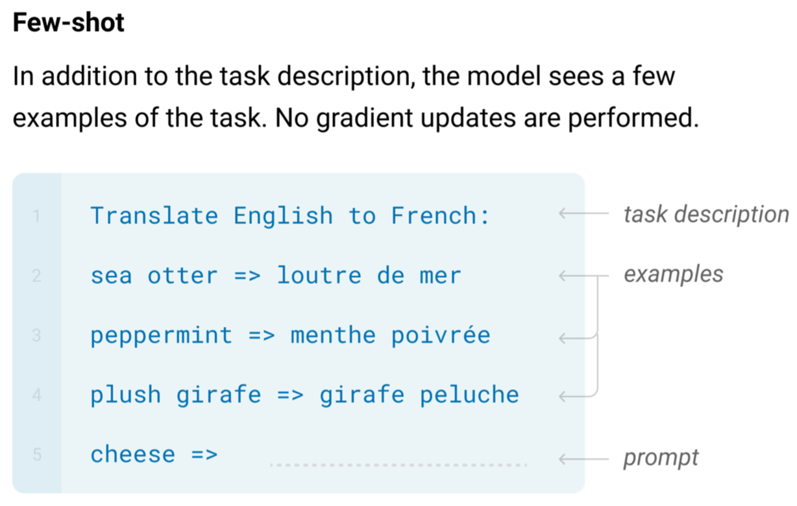

图 3-x  翻译任务示例

* 第一行：任务描述，告诉模型要做翻译

* 接下来的三行：示例对，包含英文单词和对应的法文单词

* 最后一行：待翻译的英文单词

将以上内容整体作为GPT-3的输入，模型就能输出对应的法文单词。上下文学习的应用非常灵活，除了翻译任务，还可以用于语法修饰甚至代码编写。

此外，GPT-3训练过程中并没有显式提供类似测试阶段任务描述加示例这样的训练数据。然而，由于GPT-3的训练数据量极其巨大（包含wiki、书本期刊、reddit上的讨论等），或许其中已经包含了各种任务类似结构的数据，且GPT-3模型容量足够大，能够记住所有训练数据。

目前，对于上下文学习能力的成因仍是一个开放性问题。为什么只有大规模语言模型才具备该能力？或许仅有模型参数量大还不够，还必须训练数据量足够大，模型才能显现出这种能力。这些问题仍需进一步研究和探索。

**ICL基础原理**

通过提供一些示范性的<输入-标签>对，在不需要更新模型参数的情况下，ICL可以对新输入进行准确预测。这种能力在各种应用场景中展现了极大的潜力。尽管ICL展示了出色的性能，但其具体工作原理仍然是个未解之谜。为了解释这一现象，清华大学、北京大学和微软的研究人员发表了一篇[论文](https://arxiv.org/abs/2301.00234)，将语言模型视为一种元优化器（meta-optimizer），并将ICL理解为一种隐性（implicit）的微调。这种视角帮助我们更好地理解ICL的运行机制。

ICL可以分为以下三种类型：

1. **Few-shot Learning**：提供多个示例。例如：“将中文翻译为英文。你好->hello，再见->goodbye，购买->purchase，销售->”，模型应预测下一个输出为“sell”。

2. **One-shot Learning**：提供一个示例。例如：“将中文翻译为英文。你好->hello，销售->”，模型应预测下一个输出为“sell”。

3. **Zero-shot Learning**：无示例。例如：“将中文翻译为英文。销售->”，模型应预测下一个输出为“sell”。

它的主要流程包括以下几个步骤：

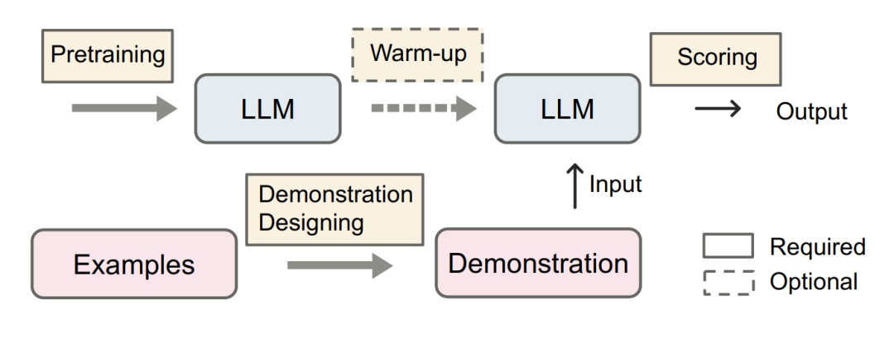

图 3-x  ICL步骤

* **预训练阶段**：通过大规模语料库进行训练，培养语言模型的ICL能力。可选的预热阶段能进一步提升模型的性能。

* **演示设计**：利用预训练的LLM和精心设计的示例，加上适当的评分策略，生成任务的最终输出。

* **推理阶段**：将示例和查询问题结合形成一个提示，输入模型进行预测。示例的质量对ICL效果并没有显著影响。

ICL的强大性能依赖于两个阶段：

* **训练阶段**：训练LLM的ICL能力。语言模型直接在语言建模目标上进行训练，如从左到右的生成。虽然这些模型并没有针对上下文学习进行特别优化，但ICL仍然具有令人惊讶的能力。

* **推理阶段**：LLM根据特定任务的演示进行预测。由于输入和输出标签都在可解释的自然语言模板中表示，因此有多个方向来提高ICL的性能。

随着模型规模和语料库的扩大，研究表明，LLMs可以利用ICL完成一系列复杂的任务，包括解决数学推理问题。这些能力已被广泛验证，显示了ICL作为大型语言模型的一种新兴能力的潜力。

ICL的核心思想基于类比学习。简单来说，ICL通过从给定的示例中提取模式，将这些模式应用于新任务，从而实现准确的预测和解决问题。

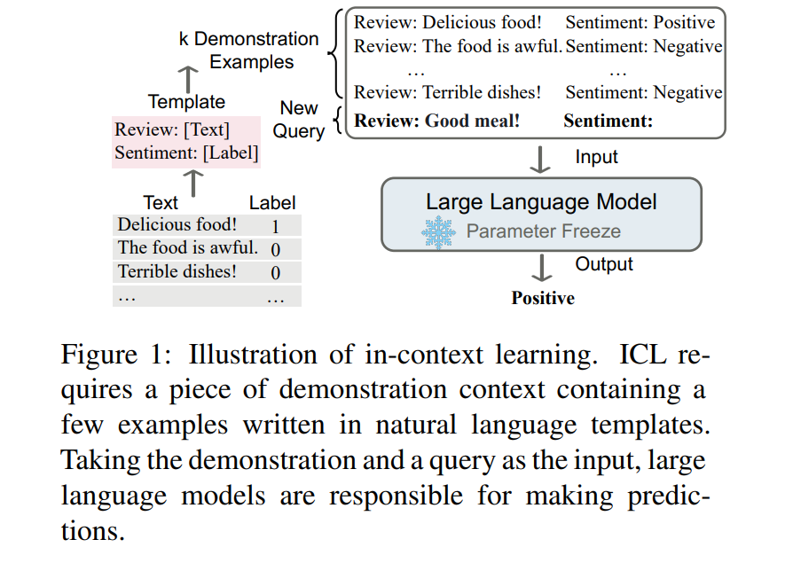

图 3-x  ICL类比学习

在ICL中，首先需要一些示例来形成演示上下文。示例通常使用自然语言模板编写。然后，ICL将一个查询问题和一个演示上下文连接在一起形成一个提示。最后，将其输入到语言模型中进行预测。ICL不需要参数更新，直接对预训练语言模型进行预测。模型被期望学习隐藏在演示中的模式，并相应地做出正确的预测。

ICL作为一种新的范式，具有许多吸引人的优势。首先，演示用自然语言格式编写，提供一个可解释的接口与大型语言模型通信。这种范式通过更改演示和模板使将人类知识纳入语言模型变得容易得多。其次，上下文学习类似于人类的类比决策过程。第三，与有监督学习相比，ICL是一种无训练学习框架。这不仅可以大大降低使模型适应新任务的计算成本，还可以使语言模型即服务成为可能，并且可以很容易地应用于大规模的现实世界任务。

然而，ICL中还有一些问题和性质需要进一步研究。尽管普通的GPT-3模型显示出ICL能力，但通过预训练期间的自适应，能力可以显著提高。此外，ICL的性能对特定的设置很敏感，包括提示模板、上下文示例的选择和示例顺序等。尽管从直观上看是合理的，但ICL的工作机制仍然不明确，很少有研究提供初步解释。

### 2.5.4 思维链 (CoT)

CoT是一种改进的Prompt策略，旨在提升LLM在复杂推理任务中的表现。与ICL不同，CoT不仅关注输入和输出，还特别强调将推理过程中的中间步骤纳入Prompt。这种方法使得模型能够更清晰地展示其思考过程，从而在算术推理、常识推理和符号推理等任务中表现出色。

**什么是 CoT？**

2022 年，Google 发表了一篇[论文](https://arxiv.org/pdf/2201.11903)，提到了一种叫做“思维链”的技术（英文名叫 Chain-of-Thought，简称 CoT）。简单来说，这种方法就是让大模型（像 ChatGPT 这样的 AI 模型）逐步将一个复杂的问题分解为更简单的几个子问题，一步一步解决，直到得出答案。这个分解过程就被称为“思维链”。

为什么要这么做呢？想象一下你在解数学题时，不是一下子直接写出答案，而是把每一个解题步骤都写下来，这样不仅更容易理解，也能让整个过程更清晰。这就是思维链的原理——通过分解问题，让 AI 更容易找到正确答案。

**传统方法与 CoT 的区别**

通常，我们对 AI 的提问就像是从输入到输出的直线过程，比如你问一个问题，AI 直接给你答案。而使用思维链时，这个过程就变成了三个部分：**输入** → **思维链（推理过程）** → **输出**。

简单举个例子，如果让 AI 回答“如果有 5 只苹果，每只苹果值 3 元，总共多少钱？” 传统的方法可能直接回答“15 元”。但使用思维链，AI 会先写出：“5 只苹果，每只 3 元，所以是 5 × 3，答案是 15 元。” 通过展示这些中间步骤，AI 的回答更容易被理解。

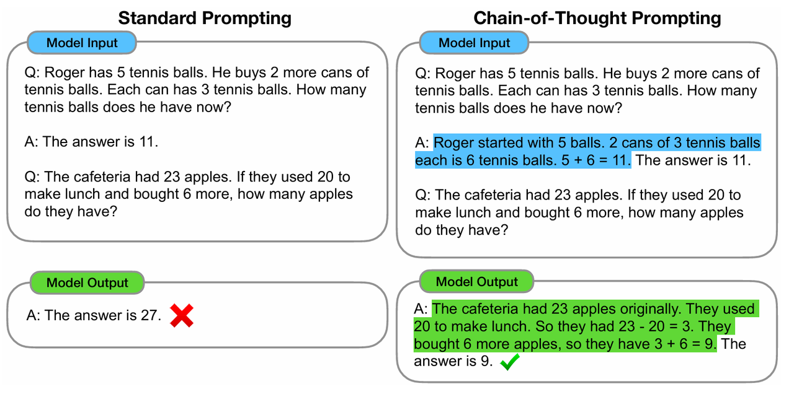

图 3-x  CoT与标准prompt步骤对比

上面这张图展示了标准提示（Standard Prompting）和思维链提示（Chain-of-Thought Prompting）的区别。

在左侧的标准提示中，我们看到模型直接给出答案，没有解释过程，因此在面对复杂问题时，模型很容易出错。比如，当被问到“Roger 有 5 个网球，他又买了 2 罐网球，每罐有 3 个网球。现在他一共有多少个网球？”时，模型直接给出了答案“11”。虽然答案正确，但没有展示中间推理步骤，这使得它的可靠性和理解性较低。

在右侧的思维链提示中，模型被要求逐步解释整个过程：“Roger 最开始有 5 个网球，又买了 2 罐网球，每罐有 3 个网球，总共有 6 个网球。5 + 6 = 11。” 通过一步步地展示推理过程，模型不仅得到正确答案，而且让人清楚地看到解题的逻辑。

另一个例子中，食堂有 23 个苹果，用掉了 20 个来做午餐，又买了 6 个苹果，还剩多少个苹果？标准提示下模型回答“27”，这是错误的。而使用思维链提示，模型会一步步解释：“原本有 23 个苹果，做午餐用掉了 20 个，所以还剩 3 个。然后又买了 6 个苹果，所以 3 + 6 = 9 个苹果。” 最终得到正确答案。

**CoT 的不同类型**

通过将采用思维链（CoT）方法的提示（Prompt）进行细致的分解，我们可以更深入、更清晰地洞察到思维链的工作机制和流程。根据是否包含示例，我们可以将思维链分为两种：

* **Zero-Shot-CoT**：没有提供具体的例子，只是在问题中加一句“让我们一步步思考”（Let's think step by step）。这种简单的提示就能“唤醒” AI 的推理能力。

* **Few-Shot-CoT**：给 AI 一些例子，每个例子都包含问题、推理过程和答案，像是给 AI 讲解解题步骤。通过这些例子，AI 就能模仿这些推理步骤解决新问题。

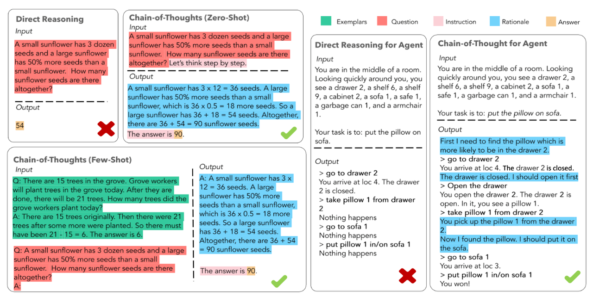

图 3-x  CoT的分类与实例

上面这张图展示了标准提示（Direct Reasoning）和思维链提示（Chain-of-Thought Reasoning）的区别。

在左侧的直接推理中，我们看到模型直接给出答案，没有解释过程，因此在面对复杂问题时，模型很容易出错。比如，问到“小向日葵有 3 打种子，而大向日葵比小向日葵多 50% 的种子，一共有多少种子？”时，模型直接得出错误的答案“54”。

而在右侧的思维链推理中，模型被要求逐步解释整个过程：“小向日葵有 3 打种子，即 3 × 12 = 36 个种子，大向日葵比小向日葵多 50%，也就是 36 × 0.5 = 18 个种子。所以大向日葵有 36 + 18 = 54 个种子，总共有 36 + 54 = 90 个种子。” 通过一步步展示推理过程，模型不仅得出正确答案，而且让人清楚地看到解题的逻辑。

**为什么 CoT 有效？**

目前为止，还没有一个完全被大家认可的科学解释来说明为什么思维链有效。不过，有很多实验观察到了一些有趣的现象，可以帮助我们理解 CoT：

* **模型规模要足够大**：如果 AI 太小（比如理解力不足），思维链可能就不起作用，因为它连基础知识都还不理解。

* **任务不能太简单**：对于一些非常简单的问题，思维链没有太大帮助，因为 AI 已经能直接给出答案。

* **训练数据的联系**：如果 AI 在训练中学到的数据彼此联系紧密，思维链的效果会更好。

* **示例中的错误**：有趣的是，即使给 AI 的示例中有些错误步骤，思维链依然有效。这说明 CoT 更像是在“指挥” AI 去做一步步的推理，而不是教 AI 具体怎么做。

简而言之，思维链的效果，可能在于它强迫 AI 按步骤思考，就像老师要求学生把解题过程写下来一样，不仅是为了得到答案，更是为了更好地理解问题的过程。

### 2.5.5 CAMEL中的prompt

现在我们来看看如何使用 CAMEL 的 Prompt 功能，通过实操来更好地理解Prompt的概念。

**使用CoT提示创建特定任务Agent**

CAMEL 提供了一些便捷的工具来帮助用户使用 CoT。我们可以使用 `TaskSpecifyAgent` 创建一个特定任务Agent，它会自动调用带有 CoT 的模板。例如，下面是代码示例：

在这个例子中，我们使用 `TaskSpecifyAgent` 生成了一个带有思维链的任务提示，通过为 Agent指定角色，让它逐步生成问题的解决方案。

**使用自定义 Prompt 模板**

CAMEL 还允许用户创建自己的 Prompt 模板，使得生成的 Prompt 更加符合用户的需求。我们可以编写自己的思维链提示模板，然后将它应用到 `TaskSpecifyAgent` 中。下面是一个简单的示例：

通过这些实操示例，我们可以看到如何通过 CAMEL 的 Prompt 功能来使用思维链提示，这样不仅可以使输出结果更具逻辑性，还能更好地控制 AI 生成内容的质量和相关性。

**使用 `TextPrompt` 类编写你的提示词**

在这一部分中，我们将探索 `TextPrompt` 类并理解其功能。`TextPrompt` 类是内置 `str` 类的子类，为处理文本提示提供了额外的功能。

> `TextPrompt` 类简介

`TextPrompt` 类表示一个文本提示，并扩展了 `str` 类的功能。它提供了一个名为 `key_words` 的属性，该属性返回一个字符串集合，表示提示中的关键词。

下面是如何使用 `TextPrompt` 类的示例：

在上面的示例中，我们创建了一个包含姓名和年龄关键词的格式字符串的 `TextPrompt` 实例。我们可以像 Python 中的 `str` 一样打印 `TextPrompt`。

> 使用 `TextPrompt` 类

一旦创建了 `TextPrompt` 实例，我们就可以使用该类提供的各种方法和属性来操作和处理文本提示。

`key_words` 属性返回一个字符串集合，表示提示中的关键词。

在上面的示例中，`key_words` 属性返回一个表示提示中关键词的字符串集合，在这种情况下是 'name' 和 'age'。

`format` 方法重写了内置的 `str.format` 方法，允许部分格式化格式字符串中的值。它用提供的值替换格式字符串中的关键词。

在上面的示例中，我们使用 `format` 方法将关键词 `{name}` 和 `{age}` 替换为值 'John' 和 30。

我们还可以通过只提供部分值进行部分格式化：

在上面的示例中，我们仅提供 `name` 关键词的值，而 `age` 关键词保持不变。当我们想在不同代理中对 `TextPrompt` 的不同关键词进行格式化时，这种方式很有帮助。

我们可以对 `TextPrompt` 实例执行各种字符串操作，如连接、连接和应用类似于 Python `str` 的字符串方法。

在上面的示例中，我们演示了使用 `+` 运算符进行连接、使用 `join` 方法进行连接以及将 `upper` 方法应用于 `TextPrompt` 实例。生成的提示也是 `TextPrompt` 的实例。

除此以外，CAMEL 提供了多种支持的 Prompt 模板，以满足不同类型的任务需求。具体可以参考这个[Blog](https://docs.camel-ai.org/key_modules/prompts.html#concept)

## 2.6 Memory

### 2.6.1 简介

在Agent系统中，Memory模块是一个关键的组件，其主要功能是存储和检索信息，以支持agent的学习和决策过程。该模块模拟人类记忆的某些特征，能够动态地保存和更新信息，使agent能够利用过去的经验进行推理和决策。

**为什么要有Memory模块？**

试想一下，当你和agent交互时，如果agent没有记忆，那就没法进行多轮对话了。你每次提问都相当于重新开始一个对话，对话就不具备连续性。

Memory模块通常包括以下几个核心功能：

1. **信息储存**：能够高效存储多种形式的数据，包括事实、事件、规则和上下文信息，以便在需要时快速访问。

2. **信息检索**：支持根据特定查询或上下文快速检索相关信息，帮助agent在需要时做出准确的判断。

3. **记忆更新**：能够根据新的信息和经验动态更新存储内容，以反映环境或任务的变化。

4. **记忆管理**：包括老化机制和优先级管理，确保较重要的信息能够长期保留，而不再需要的信息可以被有效清除，以优化存储资源的使用。

CAMEL 中的Memory模块提供了一个灵活的系统，用于存储、检索和管理 Agent的信息。它使Agent能够在对话中维护上下文，并从过去的交互中检索相关信息，从而提高 AI 响应的连贯性和相关性。

### 2.6.2 **ChatHistoryBlock**

ChatHistoryBlock 是一个基于键值存储的聊天历史记忆块实现。

* 使用键值存储后端(BaseKeyValueStorage)

* 支持窗口式检索

* 实现消息权重衰减机制

  **初始化参数**

* `storage`: 存储后端,默认使用`InMemoryKeyValueStorage`

* `keep_rate`: 历史消息权重衰减率,默认 0.9

  该模块主要实现了以下方法：

* `retrieve()`：使用可选的窗口大小获取最近的聊天记录

* `write_records()`：将新记录写入聊天记录

* `clear()`：删除所有聊天消息

**keep\_rate概述**

`keep_rate`是 CAMEL 记忆系统中用于控制历史消息权重衰减的重要参数。它主要用于调整历史消息在上下文中的重要性。

* 取值范围: \[0,1]

* 默认值: 0.9

* 作用对象: 非system消息(system消息始终保持 score=1.0)

它的工作原理是在检索历史消息时:

1. 最新消息的 score 初始值为 1.0

2. 每往前一条消息,score 会乘以 keep\_rate

3. 最终每条消息的 score 值决定了其在上下文中的重要性

现在假设有5条历史消息,keep\_rate=0.9:

| 消息位置 | Score 计算     | 最终 Score |
| ---- | ------------ | -------- |
| 最新消息 | 1.0          | 1.0      |
| 往前1条 | 1.0 \* 0.9   | 0.9      |
| 往前2条 | 0.9 \* 0.9   | 0.81     |
| 往前3条 | 0.81 \* 0.9  | 0.729    |
| 往前4条 | 0.729 \* 0.9 | 0.656    |

实际上，它的工作原理和我们人脑很像，我们对于近期的事情印象会更深刻，而对于久一些的事情反之。以下是一些值得注意的点：

1. score 不影响消息的存储,但它会在总token数超过限制时决定哪些消息在生成下文时应该被保留。

2. system消息不受 score 影响，也就是说在生成下文的时候，system\_msg会一直保留。

3) keep\_rate 与 window\_size 可以配合使用来更好地控制上下文

4) 过低的 keep\_rate 可能导致有价值的历史信息被过度弱化

5. 过高的 keep\_rate 可能导致上下文过于冗长

**示例用法**

我们可以通过以下例子直观感受keep\_rate在ChatHistoryBlock中的作用。

### 2.6.3 VectorDBBlock

`VectorDBBlock` 是一个基于向量数据库的语义记忆块实现。有关向量的部分可以参考[第五章](https://fmhw1n4zpn.feishu.cn/docx/AF4XdOZpIo6TOaxzDK8cxInNnCe#share-EufWdDs8soIeExxL39jcOdcBnzg)。

* 使用向量存储后端（`BaseVectorStorage`）

* 支持语义相似度检索

* 实现消息的向量化存储

**初始化参数**

* `storage`：可选 BaseVectorStorage （默认：`QdrantStorage`)

* `embedding`：可选 BaseEmbedding（默认值：`OpenAIEmbedding`)

该模块主要实现了以下方法：

* `retrieve()`：根据关键字获取相似记录

* `write_records()`：将新记录转换并写入矢量数据库

* `clear()`：从向量数据库中删除所有记录

该模块的工作流程如下：

1. 存储过程:

   * 将消息内容转换为向量表示

   * 生成唯一标识符（UUID）

   * 将向量和原始消息存入向量数据库

2. 检索过程:

   * 将查询关键词转换为向量

   * 在向量空间中搜索相似向量

   * 返回相似度最高的记录

**示例用法**

这里如果不定义VectorDBBlock中的`embedding`参数的话，则会调用默认的OpenAI的text-embedding-3-small模型，需要对应的OpenAI的API KEY，贴心的是，CAMEL也为我们提供了一个方便快捷的方式去一键调用我们的本地embedding模型，只需要导入`SentenceTransformerEncoder`，然后根据场景选择我们想用的embedding模型（默认为intfloat/e5-large-v2），这里是中文场景，笔者选择了bge-m3作为我们的embedding模型，模型的选择以及更多相关信息可以参考[Hugging Face(embedding\_model)](https://huggingface.co/models?library=sentence-transformers)以及我们的[Embedding章节](https://fmhw1n4zpn.feishu.cn/docx/AF4XdOZpIo6TOaxzDK8cxInNnCe#share-CTBSdtqsPowmFyxdH6wcmEXVnKh)。

### 2.6.4 CAMEL中的具体实践

在CAMEL中目前支持key\_value，graph，vector三种形式对于LLM信息进行存储，以供需要的时候检索。大模型生成自然语言文本的核心原理是基于预测。具体来说，语言模型的主要任务是根据给定的上下文预测下一个词。

CAMEL中主要会使用两个chat\_history以及context两个数据结构处理记忆信息。其中Chat\_history用于规范agent使用过程中的聊天记录，context部分用于从chat\_history中获取上下文，由于模型有输入token的限制，因此如何从记录中获取到足够有效且重要的上下文并提供给模型至关重要。CAMEL通过权重的机制从chat\_history中筛选重要的部分组成context，从而保证决策能力的有效性。

下面使用一个案例演示一下CAMEL中memory的实现，我们首先创建一个memory对象，之后创建一个agent，并将memory对象赋值给agent的memory属性。

我们首先直接调用agent试一下：

之后我们将之前设定的memory赋值给agent：

可以看到我们新创建的智能体就能够根据设定好的记忆来回答问题了。

## 2.7 Tools&#x20;

### 2.7.1 工具说明

工具(Tools)是大语言模型(LLM)与外部世界交互的桥梁。虽然LLM具有强大的语言理解和生成能力,但它们本质上是封闭的语言模型,无法直接:

* 获取实时信息(如天气、新闻)

* 访问外部数据(如数据库、文件)

* 执行具体操作(如发送邮件、控制设备)

为了克服这些限制,我们需要为LLM配备各种工具,使其能够:

* 通过API获取实时数据

* 调用外部服务

* 执行特定任务

* 与其他系统交互

工具充当允许 LLM 与世界交互的接口。工具本质上是一个具有名称、描述、输入参数和输出类型的函数。在本节中，我们将介绍 CAMEL 目前支持的工具，并解释如何定义您自己的工具和工具包。

**工具：**&#x5DE5;具类似于 OpenAI Functions。在 CAMEL，我们提供了各种常用工具，您可以直接使用。虽然内置工具可能非常有用，但您很可能需要定义自己的工具。下文会说明如何创建自定义工具。

**工具包：**&#x5DE5;具包是旨在良好协同工作的工具集合。

### 2.7.2 动手实践

下面我们可以通过一个直观的例子，展示为什么工具是必要的，（这里需要使用原生带工具调用的模型）：

这里我们先问一个数学问题。

可以看到模型给出了回答，乍一看好像是对的，但实际上19987 + 2133应该等于22120。可以发现模型即使在处理这种简单的加法的时候，也不一定能给出准确的答案，这和模型的训练有关。

这时候我们可以定义一个小工具：

**示例：定义数学工具**

首先，定义您的函数并使用`FunctionTool`

**访问工具属性**

定义工具后，您可以使用内置方法检查其属性：

检索函数的名称：

获取函数作用的描述：

之后我们重新定义一下agent。

可以看到这次模型给出了正确的结果，并且通过以下的命令可以检查工具是否真的被调用：

### 2.7.3 进阶案例

在这个案例中，我们将会建立一个小型的AI-Society系统，这个案例中将会用到之前提到过的RolePlaying模块，不同的的是，这次我们会给Assistant Agent 配备相应的工具。

输出如下:

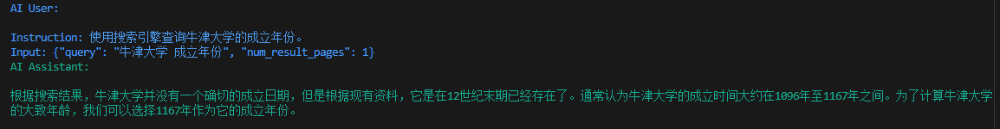

可以看到对于自己不了解或者不确定的内容，Agent系统会主动去用搜索工具搜索相应的信息，有的小伙伴可能会有疑问啦，我们怎么确定Agent系统是否真的是调用了搜索工具去找寻了对应的内容才给出的回答还是出现了幻觉呢，麻烦一点的办法就是我们去搜索一下对应的query，看一下是不是真的是模型输出的那样：

可以发现Google搜索的内容显示结果正如模型输出的那样：牛津大学真的没有确切的成立时间！说明模型并没有出现幻觉，而是参考了搜索的结果。

可是每次都这样去验证很耗费时间，Luckily！CAMEL贴心的在Info里设置了工具调用信息对应的消息：

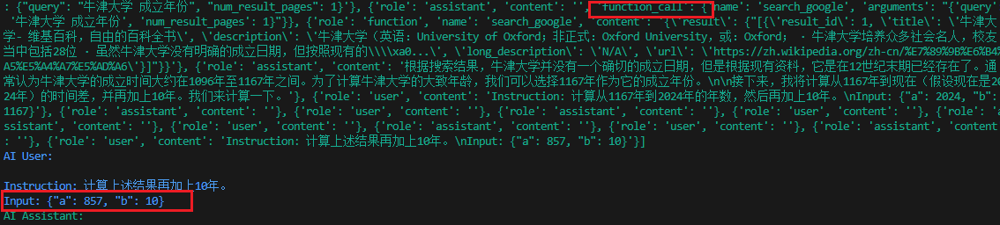

在调用工具时，CAMEL框架会将每一次FunctionCall都记录下来，方便我们后续查看、验证。

## 2.8 第二章课程作业

**Task1**

* 现在来布置一些作业，帮助你利用 CAMEL 的 Prompt 功能进行练习：

1. **角色扮演任务Agent**：使用 `AISocietyPromptTemplateDict`，创建一个角色扮演任务Agent。假设你想让 AI 扮演一个“健康顾问”，为一个“患者”提供饮食和锻炼建议。请用思维链方式分解整个建议过程，逐步提供健康方案。

2. **代码生成任务**：利用 `CodePromptTemplateDict`，创建一个任务Agent，帮助用户学习一门新的编程语言（例如 Python）。要求 AI 逐步生成学习计划，包括基本概念、代码示例和练习题目。

通过这些作业，你可以熟练掌握如何使用 CAMEL 的 Prompt 功能，并更好地理解思维链的应用方式。

**Task2**

* 创建一个自己的工具，并让LLM使用它完成一个任务。

***

# 3. 第三章: CAMEL框架简介及实践&#x20;

在本章中，我们将简要介绍多智能系统和 CAMEL框架。

## 3.1   CAMEL框架简介&#x20;

### 3.1.1 Multiple Agent基本概念

* **定义**：多智能体（Multiple Agent）由多个相互作用的智能体组成，每个智能体都有自己的目标和策略。这些智能体可以相互通信、协作或竞争，以实现更复杂的行为和决策。

* **应用**：多智能体系统广泛应用于复杂的任务中，如交通管理、分布式机器人系统、经济市场模拟、多玩家游戏等。

* **特点**：

  * **协作**：智能体之间可以协作，共同解决问题。

  * **竞争**：智能体之间也可以存在竞争关系，如在拍卖或游戏场景中。

  * **自主性**：每个智能体都有自己的决策过程，保持一定程度的自主性。

  * **复杂性**：多智能体系统的设计与分析比单一智能体系统更复杂，因为需要考虑智能体之间的交互和协调。

  * **鲁棒性**：多智能体系统通常具有更好的鲁棒性，因为系统的稳定性和效能不完全依赖于单一决策者。&#x20;

### 3.1.2 什么是CAMEL?

CAMEL (Communicative Agents for "Mind" Exploration of Large Language Models) 是一个开源的多智能体框架，专注于构建基于大语言模型的智能体交互系统。该框架通过角色扮演和结构化对话机制，实现智能体之间的有效协作。

在CAMEL框架中，ChatAgent 是最基础的智能体单元，负责处理对话逻辑和任务执行。而`RolePlaying` 和`Workforce` 则是多智能体系统，用于协调多个智能体的协作。

详见我们的开源仓库和项目主页&#x20;

* 论文：<https://ghli.org/camel.pdf>

* 项目主页：<https://www.camel-ai.org/>&#x20;

### 3.1.3  ChatAgent 简介

ChatAgent 是 CAMEL 框架的基础构建块，其设计目标是回答以下问题：“如何设计一个自主的交互式智能体，使其能够在最少人工监督的情况下，引导对话完成任务？”

在当前实现中，我们的智能体具备以下关键特性：&#x20;

* **角色 (Role)**：结合目标和内容规范，设定智能体的初始状态，引导智能体在连续交互过程中采取行动。

* **大语言模型 (LLMs)**：每个智能体都使用大语言模型来增强认知能力。大语言模型使智能体能够理解和生成自然语言，从而解释指令、生成响应并参与复杂对话。

* **记忆 (Memory)**：包括上下文记忆和外部记忆，使智能体能够以更扎实的方式进行推理和学习。

* **工具 (Tools)**：智能体可以使用的一组功能，用于与外部世界交互，本质上是为智能体提供具身化能力。

* **通信 (Communication)**：我们的框架允许智能体之间进行灵活且可扩展的通信，这是解决关键研究问题的基础。

* **推理 (Reasoning)**：我们为智能体配备了不同的规划和奖励（评论员）学习能力，使其能够以更有指导性的方式优化任务完成。

### 3.1.4  Role Playing机制

RolePlaying是CAMEL框架的独特合作式智能体框架。该框架通过预定义的提示词为不同的智能体创建唯一的初始设置，帮助智能体克服诸如角色翻转、助手重复指令、模糊回复、消息无限循环以及对话终止条件等多个挑战。

#### 3.1.4.1 基本概念

1.1 **角色定义**

* **Assistant角色**: 负责执行具体任务并提供解决方案的智能体

* **User角色**: 负责提供指令和任务需求的智能体

* **特定领域角色**: 如程序员、交易员等专业角色

1.2 **交互规则**

**1.3 关键机制**

* **角色固定**: 防止角色翻转，维持对话的稳定性

* **格式规范**: 要求回复具有固定的开始和结束格式

* **任务分解**: 自动将复杂任务分解为可执行的子任务

* **循环对话**: 通过轮流发言推进任务进展

**2.工作流程**

2.1 **初始化阶段&#x20;**

* 设定角色身份

* 加载系统提示词

* 明确任务目标

2.2 **执行阶段&#x20;**

* User提供具体指令

* Assistant执行并给出解决方案

* 循环往复直至完成任务

**应用场景示例**

Web应用开发

创业计划设定

个性化教学辅导

金融分析

医疗健康

#### 3.1.4.2 经典案例: 股票交易机器人详解

以下是一个对于Role-Playing的经典应用， 股票交易实例。在本案例中，我们通过角色扮演的方式来构建一个交易机器人。初始阶段，人类用户提出一个概念性任务，由一个专用Agent精确化为详细的任务描述。参与完成任务的有两个agent：一个扮演股票交易员，另一个扮演Python程序员。

**工作流程：**

以上代码中，`task_prompt` 是用户输入的任务提示词，即“Develop a trading bot for the stock market”。创建 `role_play_session` 时，将 `task_prompt` 传递给了 `RolePlaying`。`RolePlaying`的作用是根据任务提示词，将任务分解为具体的任务小点，并与相应的AI角色进行交互。

具体来说，在这个例子中，助手角色是“Python Programmer”，用户角色是“Stock Trader”。通过这种方式，框架中的Agent可以将用户输入的较为抽象的任务转化为具体的任务小点，以便更好地进行交互和实现具体的功能。

这种设计可以帮助Agent更有针对性地理解任务，并根据具体的任务小点进行回答和执行操作。通过角色扮演会话，即使用户不懂技术，也能实现复杂的想法。Agent们们会通过对话和合作来帮助用户将想法转化为现实。这种方法不仅使得技术实现变得更加容易，也为人工智能的应用开辟了新的可能性，让创造变得更加简单和有趣。

&#x20;RolePlaying工作流程图

**&#x20;角色设定：** &#x20;

* Python程序员(Assistant)：负责实现交易逻辑和代码

* 股票交易员(User)：提供交易策略和业务需求

**任务具体化**

任务具体化Agent将初步想法转换成详细任务描述：“开发一个基于机器学习的股票交易机器人，能够自动分析市场趋势、执行买卖操作，并实时调整策略以优化投资组合。”

**具体过程**

* **步骤1: 任务提出**

人类用户提出希望开发一个交易机器人。

* **步骤2: 定义AI角色**

设定合适的AI角色（股票交易员和Python程序员）来实现用户的想法。

* **步骤3: 任务具像化**

任务具体化Agent为AI角色提供明确的任务描述，以便更好地理解和执行。比如：将“开发一个用于股票市场的交易机器人。”进一步具像为：“开发一个基于机器学习的股票交易机器人，能够自动分析市场趋势、执行买卖操作，并实时调整策略以优化投资组合。”

* **步骤4: 任务拆分**

总体任务会由AI用户（股票交易员）来进一步拆分为各个子任务，确保AI助手（Python程序员）能够理解并执行子任务。例如：

* **步骤5: 对话和合作**

程序员AI和交易员AI开始对话和合作：

* **步骤6: 完成任务**

通过这种对话和合作的方式，两个AI角色能够一步步地共同完成任务，最终创建出一个用于股票市场的交易机器人。

示例视频(model使用qwen2.5:7b)：

### 3.1.5 Workforce 简介

Workforce是CAMEL框架中的一个多智能体协同工作系统。它以一种简洁的方式让多个智能体协作完成任务，类似于一个高效的团队合作系统。

更详细的使用信息，请参考我们的[对应内容](https://fmhw1n4zpn.feishu.cn/docx/AF4XdOZpIo6TOaxzDK8cxInNnCe#share-T4t0dbCrqoKV1qx8EbdcIAtpnwb)

**架构设计**

Workforce采用层级架构设计。一个workforce可以包含多个工作节点(worker nodes)，每个工作节点可以包含一个或多个智能体作为工作者。工作节点由workforce内部的协调智能体(coordinator agent)管理，协调智能体根据工作节点的描述及其工具集来分配任务。

除了协调智能体外，workforce内部还有一个任务规划智能体(task planner agent)。任务规划智能体负责任务的分解和组合，使workforce能够逐步解决任务。

**通信机制**

Workforce内部的通信基于任务通道(task channel)。Workforce初始化时会创建一个所有节点共享的通道。任务会被发布到这个通道中，每个工作节点会监听通道，接受分配给它的任务并解决。

当任务完成后，工作节点会将结果发布回通道，结果会作为其他任务的"依赖项"保留在通道中，供所有工作节点共享。

通过这种机制，workforce能够以协作和高效的方式解决任务。

**故障处理**

Workforce具有故障处理机制。当任务失败时，协调智能体会采取行动修复。这些行动可以是：

* 将任务分解为更小的任务并重新分配

* 创建一个能够完成该任务的新工作者

目前，协调智能体根据任务被分解的次数来做决策：

* 如果任务已经被分解超过特定次数，协调智能体会创建新的工作者

* 如果没有超过，协调智能体会采取任务分解的行动

有些任务可能智能体根本无法解决。为了防止workforce陷入无限的智能体创建循环，如果一个任务失败次数超过特定次数（默认为3次），workforce将会停止。

**Workforce 实例讲解**

这一部分将通过以下多智能体工作流（multi agent workforce）展示如何利用多个智能体（agents）和角色分工完成复杂任务

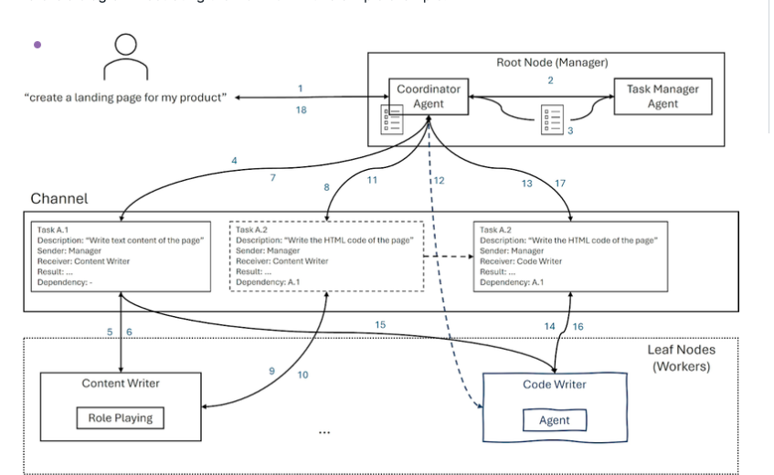

**总体概述**

该系统由多个智能体（agents）组成，每个智能体在一个组织结构中扮演特定角色，协同完成复杂任务。流程图展示了如何通过以下智能体协作完成一个请求（如“创建一个产品的登录页面”）：

* **Root Node (Manager)**：作为系统的管理者，负责接收任务并协调任务的分解和分配。

* **Coordinator Agent (协调智能体)** 和 **Task Manager Agent (任务管理智能体)**：管理任务分解、依赖关系、分发任务，以及监控任务完成情况。

* **Leaf Nodes (Workers)**：执行任务的实际智能体，分别承担不同的角色（如“内容撰写者”和“代码撰写者”）。

**流程讲解**

**(a) 用户需求的接收**

用户发出任务请求（例如“创建一个登录页面”，图中 1）。

**Coordinator Agent** 接收需求，作为入口点。

**(b) 任务分解与定义**

**Coordinator Agent** 通过任务分解策略，将请求拆分为多个子任务（如任务 A.1 和 A.2），并定义：

这些任务被送到 **Task Manager Agent** 进行分发（图中 2 和 3）。

**(c) 任务的分配**

**Task Manager Agent** 将任务分发到 **Channel**（图中 4），这是一个任务管理中枢。

任务按角色需求分配到 **Leaf Nodes (Workers)**，包括：

**(d) Leaf Nodes 执行任务**

**内容撰写者 (Content Writer)**：

**代码撰写者 (Code Writer)**：

**(e) 结果整合与返回**

**Coordinator Agent** 汇总所有任务结果（如 A.1 和 A.2 的结果）。

将完整的任务结果返回给用户（图中 18）。

**多智能体工作流系统特性**

**任务分解**：将复杂任务分解为简单子任务。

**角色分工**：根据任务类型分配给不同智能体。

**依赖管理**：智能管理任务之间的依赖关系。

**高效协作**：智能体协同工作，快速完成目标

由于多智能体工作流的系统特性，该流程可适用于多个角色分工协作饿的场景，如软件开发、内容生产和项目管理等。

## 3.2 创建你的第一个Agent Society

### 3.2.1  准备工作

在 CAMEL 中主要是多智能体的实现主要是通过角色扮演`Role-Playing`的方式，让智能体扮演特定的角色，并拥有相应角色的专业知识背景。这些智能体通过对话和合作来共同完成任务。在多智能体系统接收到人类用户的初步想法和角色分配后，任务指定智能体将提供详细的描述，使想法更加具体化。然后，AI助理和AI用户将通过多轮对话合作完成指定的任务，直到AI用户确定任务完成为止。一方面，AI用户负责向AI助理提供指令，并引导对话朝着任务完成的方向进行；另一方面，AI助理则需要遵循AI用户的指示，做出回答并提供具体的解决方案。

面向任务的 `RolyPlaying()` 类。我们以指令跟随的方式设计这个类。其本质是，要解决复杂任务，可以让两个交流智能体一步一步地协作，共同寻找解决方案。主要概念包括：

* **任务**：任务可以简单到一个想法，由初始提示启动。

* **AI 用户**：预期提供指令的智能体。

* **AI 助手**：预期提供满足指令的解决方案的智能体。

以下展示了 `RolePlaying` 对象的主要参数配置及其默认值和描述：

| 参数名称                        | 类型                  | 默认值                  | 描述                                                                 |
| --------------------------- | ------------------- | -------------------- | ------------------------------------------------------------------ |
| assistant\_role\_name       | str                 | 无                    | 助手智能体所扮演角色的名称(合理的名称设置有利于提高agent的能力)。                               |
| user\_role\_name            | str                 | 无                    | 用户智能体所扮演角色的名称(合理的名称设置有利于提高agent的能力)。                               |
| critic\_role\_name          | str, optional       | "critic"             | 评审者智能体所扮演角色的名称。如果名称为 "human"，则评审者将被设置为人类Agent，否则将创建一个 CriticAgent。 |
| task\_prompt                | str, optional       | ""                   | 要执行任务的提示。                                                          |
| with\_task\_specify         | bool, optional      | True                 | 是否使用任务明确化Agent。                                                    |
| with\_task\_planner         | bool, optional      | False                | 是否使用任务规划Agent。                                                     |
| with\_critic\_in\_the\_loop | bool, optional      | False                | 是否在循环中包含一个评审者。                                                     |
| critic\_criteria            | str, optional       | None                 | 评审者Agent的评审标准。如果没有指定，则设置为提高任务性能的标准。                                |
| model\_type                 | ModelType, optional | None                 | 用于角色扮演的模型类型。如果指定，它将覆盖所有Agent中的模型。                                  |
| task\_type                  | TaskType, optional  | TaskType.AI\_SOCIETY | 要执行的任务类型。                                                          |
| output\_language            | str, optional       | None                 | Agent输出的语言。                                                        |

### 3.2.2 配置Role-Playing会话

下边用一个具体的例子一步步展示我们的`RolePlaying` 案例。

1. **设置参数**

首先我们先导入相关模块及设置相关参数：

* **组建我们的AI-Society**

在这里我们可以在日志里观察到CAMEL对每个智能体的system\_prompt的设定:

* **和你的AI-Society一起解决任务**

在开始我们的时间旅行前，我们来定义一个小的 helper 函数，我们在前文介绍过，RolePlaying机制是利用两个Agent之间的交互来完成任务，为了不让Agent陷入无限循环的输入输出，CAMEL在设计的时候就引入了终止机制，如果意外终止，这个函数可以为我们展现RolePlaying的终止原因：

OK！准备工作都已经完成了，是时候规划我们的路线了——为我们的AI-Society编写一个简单的循环来继续前进：

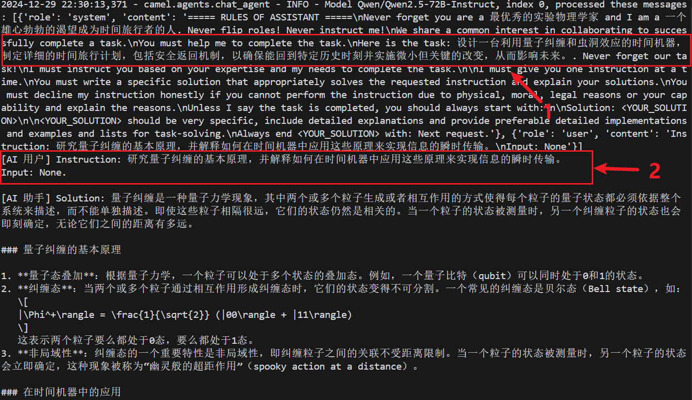

可以看到对于这样一个有趣的任务,我们的AI-Society首先会将我们的初始prompt给进一步明确化:"制定一个计划去过去并进行改变。">>>"设计一台利用量子纠缠和虫洞效应的时间机器，制定详细的时间旅行计划，包括安全返回机制，以确保能回到特定历史时刻并实施微小但关键的改变，从而影响未来。"然后再由AI\_User一步步指导AI\_Assistant完成整个任务。

**进阶学习**

引入 CrticAgent，*`with_critic_in_the_loop`&#x20;*&#x8BBE;置为`True`的时候将会在循环中引入CrticAgent，如果我们将"human"赋值&#x7ED9;*`critic_role_name`* ，我们人类将可以在与智能体之间交互中掌握主动权，去选择优化和调整，并且提升角色表现。

上述 根据 “*写一本关于AI社会的未来的书*” 的任务，将会在更详细的选择中引入人工与其交互。

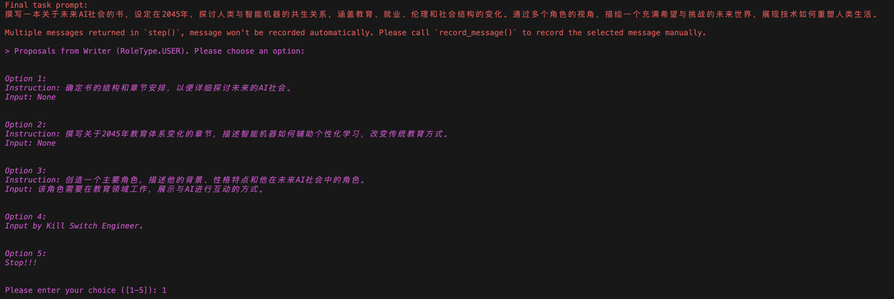

输入数字可以选择你想要让AI\_Assistant去执行的选项，如果你选择第四个选项，则将由你亲自指导AI\_Assistant，该AI-Society会要求你输入内容来指导AI\_Assistant：

但是如果，将"human"以外的参数赋值&#x7ED9;*`critic_role_name`*，则将创建一个 CriticAgent，自动与其交互。

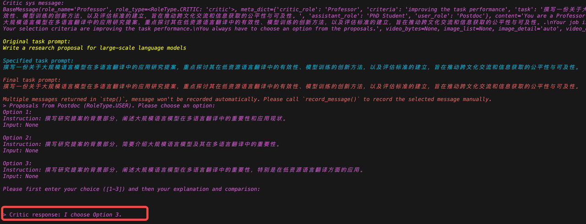

## 3.3 创建你的Workforce

### 3.3.1 简单实践

**1. 创建 Workforce 实例**

想要使用 Workforce，首先需要创建一个 Workforce 实例。下面是最简单的示例：

这段代码会生成一个名为 `一个简单的Workforce` 的实例，不过目前它还不包含任何工作节点。

> **提示：如何自定义 Workforce**
>
> 如果你只想快速上手，给 Workforce 传入一个描述就足够了；如果你需要更复杂的定制，则可以在初始化时配置工作节点列表、协调器Agent（Coordinator Agent）或任务规划Agent（Task Planner Agent）等高级参数。

***

**2. 定义worker**

接下来，我们需要给Workforce定义一些worker。我们希望在这个Workforce里有一个专业的旅游信息搜索助手、一个专业的旅行规划师、一个经验丰富的旅行爱好者。他们分别负责制定计划和评价计划，例如：

当然，你也可以按自己的喜好来定义你的Workforce。

**3. 添加工作节点**

定义好 Workforce 和worker后，你可以往里面添加工作节点（Worker Nodes）。以一个命名为 `search_agent` 的示例Agent（Agent）为例，代码如下：

如果需要一次性添加多个工作节点，可以使用方法链（Fluent Interface）来操作：

> **提示：描述很重要**
>
>
>
> 虽然看似只是一个字符串，但**工作节点的描述在任务分配中至关重要**。协调器Agent会根据节点描述来分配具体的子任务，因此你最好为每个节点写一个精准且易读的描述。

&#x34;**. 启动 Workforce 并处理任务**

准备好工作节点后，就可以创建一个任务，并让 Workforce 来处理。下面是一个简单的任务示例：

接着，调用 `process_task()` 方法即可启动 Workforce 的任务处理流程：

此时，Workforce 会根据各工作节点的描述，为它们分配合适的子任务，最终返回处理结果。你可以通过以下方式查看任务处理的最终产出：

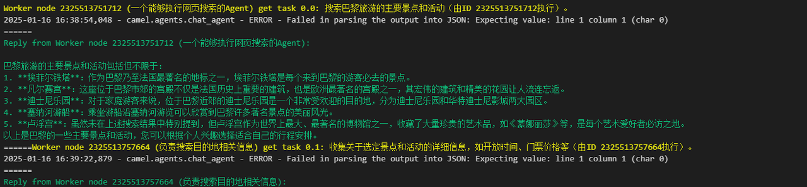

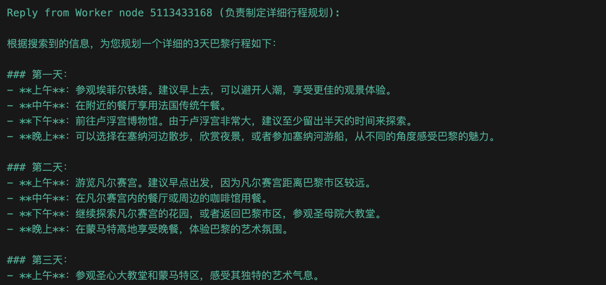

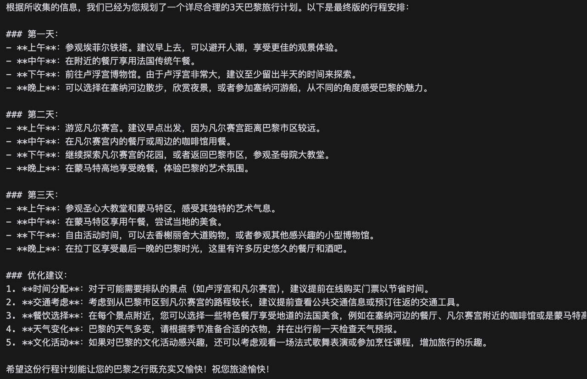

通过以上三个步骤——创建 Workforce、添加工作节点、启动并处理任务，你已经完成了一个最基本的 CAME&#x4C;**&#x20;Workforce** 使用示例。

### 3.3.2 利用Workforce组建hackathon评审团

在本小节中，我们将通过一个示例，展示如何使用 CAME&#x4C;**&#x20;Workforce** 协调多个智能体对黑客松项目进行多角度评审。通过为每个智能体赋予不同的角色与个性，我们可以模拟真实评审场景中“智囊团”之间的讨论和打分过程。

我们的创建过程主要分为以下几个阶段：

1. **创建不同个性的评审智能体（Judge Agents）**&#x6BCF;个智能体都拥有独立的“人设”和评价标准，能够从不同角度出发对项目进行打分和反馈。

2. **组建 Workforce**将这些个性化评审智能体（以及一个辅助搜索的研究者智能体）加入到一个 Workforce 中，方便统一管理和任务分配。

3) **创建 Task**将具体的项目描述和需要完成的目标封装到一个 Task 对象中，让 Workforce 来调度。

4) **处理 Task**通过调用 `Workforce.process_task()` 来让评审团协同完成项目评价，并最终生成结果。

下面，我们会一步步地拆解各核心代码模块，帮助你掌握多智能体协作的基本实现流程。

**1. 创建评审智能体**

* **多人格设定**：我们通过 `persona` 字符串刻画智能体的性格、使用的措辞和关注点，比如 “投资人” 注重商业潜力，“工程师” 注重技术稳健性等。 &#x20;

* **示例反馈**：`example_feedback` 中的示例给智能体一个参考，指导它的表达风格，以确保它在对项目进行评论时能符合角色定位。 &#x20;

* **评审标准**：`criteria` 为智能体提供了打分的准则，如从 1-4 分衡量项目的商业可行性、技术实现、创新程度等。

通过这个函数，我们可以快速生成多个“个性化的评审智能体”。然后我们可以定义一个虚拟的Hackathon项目描述，稍后我们会将它发给评委来打分：

**2. 创建辅助智能体**

然后，我们将创建 5 个独特的agent，它们稍后将一起协作。在这 5 个agent中，其中四个是评委，我们还创建了一个“助手”智能体（在示例中称为 `Researcher`），用于在线搜索相关资料并为评审提供更多信息参考。

另一方面，其他四名agent是具有不同角色设定和标准的评委。他们将根据描述以及帮助者收集的信息为项目打分。

* **工具集（Toolkit）**：这里示例给智能体添加了搜索能力，让它可以使用 Google 或 DuckDuckGo 等搜索引擎来获取最新资料。 &#x20;

* **系统消息**：通过“研究者”这一系统消息，将智能体定位为对 AI 和开源技术进行调研的角色。

这样一来，我们就拥有了一个既能执行网络搜索，也能将搜索到的信息反馈给评审智能体的辅助角色。

**3. 组建 Workforce**

* **Workforce 实例**：通过给 `Workforce` 传入一个描述（如“Hackathon Judges”）与一系列可选参数，我们就能快速搭建一个多智能体“工作台”。 &#x20;

* **添加智能体**：使用 `add_single_agent_worker()` 方法，将评审和研究者智能体逐个添加到同一个 Workforce 中。这里的字符串描述（如 “Visionary Veronica (Judge) ...”）非常重要，因为它会帮助内部的协调智能体区分并调配不同角色。

在这一步，我们将所有智能体统一到一个“协作环境”中，让它们可以一起完成后续的任务。

**4. 创建并分配任务（Task）**

* **Task 内容**：要交给 Workforce 处理的具体工作需求，例如“请评审这个项目，给出评分和总结意见”。 &#x20;

* **附加信息**：`additional_info` 可以储存项目背景描述等重要材料，Workforce 会在任务的拆解和传递过程中为各智能体保持这部分信息不变。 &#x20;

* **唯一标识**：`id` 用于标记任务编号，方便后续跟踪任务结果。

**5. 处理任务并获取结果**

最后，通过下面这行指令，Workforce 就会把任务分发给各个智能体进行协作，完成后可从 `task.result` 中获取最终的整合结果。

通过以上步骤，我们成功地搭建了一个“黑客松评审团”多智能体系统： &#x20;

1. **多个性格鲜明的评审**——投资人、工程师、AI 创业者、开源社区贡献者； &#x20;

2. **辅助性搜索者**——为评审提供最新的项目信息； &#x20;

3) **Workforce 协同**——统一调度、分配任务，并整合多方意见得到最终结果。

至此，你已经掌握了 CAMEL Workforce 的核心使用模式。赶快动手实践，在你的项目中让多个智能体“群策群力”，协同完成高效且富有创造性的工作吧！

## 3.4 第三章课程作业

**基础任务**

给上面的简单实践新增一个agent，重新编排功能。

**进阶任务**

用Workforce实现一个你自己的多智能体系统。

# 4. 第四章: CAMEL框架下的RAG应用&#x20;

本章将深入探讨在CAMEL框架下如何构建和应用RAG（Retrieval-Augmented Generation）技术。我们将介绍关键模块，包括存储、加载器、嵌入、检索器，以及如何搭建知识库和评估RAG应用。

## 4.1 RAG的组件介绍

### 4.1.1 RAG简介

要理解生成式AI的最新进展，可以想象一个法庭场景。

法官基于对法律的一般理解听取并裁定案件。有时，一些案件——比如医疗事故诉讼或劳动争议——需要特殊的专业知识，于是法官会派书记员去法律图书馆查找先例和具体的法律案例以供引用。

像优秀的法官一样，大型语言模型（LLM）能够回答各种人类问题。但如果需要提供权威答案并引用具体来源，模型需要一个助手来进行研究。

AI的“法庭书记员”就是一种被称为检索增强生成（RAG，Retrieval-Augmented Generation）的技术。

**"RAG"这个名字的由来**

2020年首次提出这一术语的论文主作者帕特里克·刘易斯（Patrick Lewis）对现在这一流行技术的不起眼缩写表示歉意。他认为这一方法已代表生成式AI的未来，相关研究已覆盖数百篇论文和众多商业服务。

"如果早知道我们的研究会被如此广泛应用，我们一定会更认真地起名字"刘易斯在一次新加坡区域数据库开发者会议的采访中说道。

"我们原本计划为这个技术取一个更好听的名字，但最终写论文时，大家都没有提出更好的想法。"刘易斯目前领导AI初创公司Cohere的一支RAG团队。

**什么是检索增强生成（RAG）？**

检索增强生成是一种通过从外部资源获取事实来提高生成式AI模型准确性和可靠性的技术。

换句话说，它弥补了LLM工作中的一个空白。从底层来看，LLM是神经网络，其能力通常通过参数数量来衡量。LLM的参数本质上代表了人类使用单词构造句子的通用模式。

这种深度理解（有时称为参数化知识）使得LLM能够以极快的速度对一般性提示做出回应。然而，当用户需要深入探讨某一当前或特定话题时，LLM可能力不从心。

**内部与外部资源的结合**

刘易斯及其同事开发了RAG技术，将生成式AI服务与外部资源相连，特别是那些富含最新技术细节的资源。

他们与前Facebook AI研究团队（现为Meta AI）、伦敦大学学院（UCL）和纽约大学的共同作者在论文中将RAG称为“一种通用的微调方法”，因为几乎任何LLM都可以使用它连接几乎任何外部资源。

**建立用户信任**

检索增强生成为模型提供了可引用的来源，就像研究论文中的脚注，用户可以查证这些信息。这有助于建立信任。

此外，这项技术还可以帮助模型澄清用户查询中的歧义，并减少模型“猜错”的可能性——这种现象有时被称为“幻觉”（hallucination）。

RAG的另一个显著优势在于其实现相对简单。刘易斯和论文的三位共同作者在博客中提到，开发者可以用少至五行代码来实现这一过程。这使得RAG比用额外数据集重新训练模型更快捷、更经济。此外，它还支持用户即时更换新的信息源。

**RAG的应用**

通过检索增强生成，用户可以与数据存储库进行交互，从而开辟新的应用体验。这意味着RAG的潜在应用可以是可用数据集数量的多倍。

例如，一个结合了医学索引的生成式AI模型可以成为医生或护士的得力助手。金融分析师可以借助与市场数据相连的助手提高工作效率。

事实上，几乎任何企业都可以将其技术手册、政策手册、视频或日志转化为知识库，以提升LLM的能力。这些资源可以支持诸如客户服务、员工培训和开发者生产力等用例。

正因如此，包括AWS、IBM、Glean、Google、Microsoft、NVIDIA、Oracle和Pinecone在内的公司正在广泛采用RAG技术。

在CAMEL框架中，RAG被用于构建智能问答系统、对话Agent等应用，充分利用了框架的模块化设计和强大的处理能力。

### 4.1.2 Loaders

**基本概念**

Loaders是CAMEL框架中用于数据加载和预处理的模块。简而言之就是在 **CAMEL 框架** 中，引入了两个 IO 模块：**Base IO** 和 **Unstructured IO**，用于处理多种文件类型以及非结构化数据的处理。此外，还新增了四种数据读取器：**Apify Reader**、**Chunkr Reader**、**Firecrawl Reader** 和 **Jina\_url Reader**，这些读取器能够从外部获取数据，从而提升数据集成与分析的能力。

**Base IO**

**Base IO 模块**专注于与文件相关的基础输入/输出操作，提供了表示、读取和处理多种文件格式的功能。

在实践环节中，该模块旨在读取各种格式的文件，提取其内容，并将其表示为 **File 对象**，每个对象都针对特定的文件类型进行了专门设计以便高效处理。

***

**Unstructured IO**

**Unstructured IO 模块&#x20;**&#x4E13;注于非结构化数据的处理、解析和加工。它提供了以下工具和功能：解析文件或URL、清洗数据、提取特定信息、为不同平台准备数据元素以及对数据进行分块处理。该模块的核心在于其高级ETL（提取、转换、加载）能力，可以对非结构化数据进行操作，使其适用于诸如 **检索增强生成（RAG）**&#x7B49;多种应用场景。

要开始使用 **Unstructured IO 模块**，首先需要导入模块并初始化其实例。初始化后，可以利用该模块执行多种功能，例如解析、清洗、提取数据，并与云服务（如 AWS S3 和 Azure）集成。以下是一个基本指南，帮助您快速上手：

**使用 `parse_file_or_url` 方法可以从文件或 URL 中加载并解析非结构化数据。以下是如何利用此方法的指导示例：**

**利用 `clean_text_data` 进行多文本数据清洗**

**目前支持的清理操作**:

* replace\_unicode\_quotes: 将Unicode引号替换为标准引号

* clean\_dashes: 清理破折号，统一格式

* clean\_non\_ascii\_chars: 清理非ASCII字符

* clean\_extra\_whitespace: 清理多余空白

* clean\_bullets: 清理项目符号

* clean\_ordered\_bullets: 清理有序列表符号

* clean\_postfix: 清理后缀

* clean\_prefix: 清理前缀

* clean\_trailing\_punctuation: 清理尾部标点

* group\_broken\_paragraphs: 合并断开的段落

* remove\_punctuation: 移除标点符号

* bytes\_string\_to\_string: 将字节字符串转换为普通字符串

* translate\_text: 翻译文本

**利用 `extract_data_from_text` 进行文本提取操作，下面是一个抽取文本中邮件地址的范例。**

`extract_data_from_text`同样有多种使用方法，更具体的使用方法可以看源码的相关注释。

**使用 `chunk_elements` 方法对内容进行分块处理**

使用 `stage_elements` 方法进行元素分阶段处理

以下是使用 **Unstructured IO 模块**的基础指南。想要了解更多高级用法，请参考具体方法的文档以及相关资源。 [Unstructured IO Documentation](https://unstructured-io.github.io/unstructured/).

***

**Apify Reader**

Apify Reader 提供了一个 Python 接口，用于与 Apify 平台交互，以实现 Web 工作流的自动化。你可以在这里获取所需要的[APIKEY](https://console.apify.com/settings/integrations)。

初始化客户端，设置所需参数。

检索结果数据库 ID 并使用 get\_dataset\_items 方法访问它。

这个函数通常用于从Apify平台获取爬取或处理后的数据，以便在后续程序中使用这些数据。

***

**Firecrawl Reader**

你可以从[此处](https://www.firecrawl.dev/)获得你的FirecrawlAPI

Firecrawl Reader 提供了一个 Python 接口来与 Firecrawl API 交互，允许用户将网站转换为大型语言模型可读的 markdown 格式。

初始化客户端并设置要从中检索信息的 URL。当状态为 “completed” 时，信息检索已完成并可供阅读。

直接从返回的结果中检索信息。

***

**Jina\_url Reader**

JinaURL Reader 是 Jina AI 的 URL 读取服务的 Python 客户端，经过优化，可从 URL 提供更清晰、对 LLM 可读的内容。该reader提供一定额度的免费调用次数。无需注册API也可使用。

### 4.1.3 Embddings

**基本概念**

为不同类型的数据（文本、图像、视频）创建嵌入的过程，是将这些输入转化为机器能够理解和高效处理的数值形式。每种嵌入都专注于捕获其对应数据类型的核心特征。以下是对主要数据类型嵌入的简要说明：

**文本嵌入**

文本嵌入（Text Embeddings）将文本数据转换为数值向量，每个向量代表文本的语义含义，使我们能够基于意义而非文本的原始形式处理和比较文本。通过这种方式，机器可以捕获语言中的上下文和细微差别。

**嵌入技术**

1. **OpenAI Embedding**:

   * 使用大规模语言模型（LLM）生成嵌入，能够理解语言中的复杂语境和语义细节。

   * 例如，`text-embedding-3-small` 模型生成 1536 维嵌入向量。

2. **SentenceTransformerEncoder**:

   * 专为生成句子级别的嵌入设计，通常基于 BERT 等模型。

   * 强调对句子语义的捕获，适合文本比较或语义搜索任务。

**示例：语义比较**

**句子 1**: “A young boy is playing soccer in a park.”
**句子 2**: “A child is kicking a football on a playground.”

尽管两句话用词不同，但它们表达的语义非常相似。

&#x20;文本嵌入模型会将这些句子转换为高维向量，例如 1536 维。如果我们比较这两个向量，计算出的相似度值（如余弦相似度）会较高，表明它们具有相近的语义。

***

**语义处理的意义**

1. **语义相似性**: 嵌入捕获了“孩子在户外踢球”的共同概念，而不是简单地依赖词语的字面匹配。

2. **应用场景**:&#x20;

   * **信息检索**: 根据语义找到相关内容，而非精确关键词匹配。

   * **问答系统**: 理解用户提问的核心含义并生成精准答案。

   * **文本聚类与分类**: 根据嵌入向量的分布，聚类相似语义的文本。

通过文本嵌入，机器不仅可以理解语言表面的表达，还能更深层次地处理和分析其语义关联，使语义搜索、文本匹配等任务更为智能和高效。

***

**图像嵌入**

图像嵌入是一种将图片转化为数值向量的技术，这些向量能够表示图像中的关键特征，比如形状、颜色、纹理和空间层次。通过这种方式，机器可以理解图像的核心内容，并以此完成分类、检索和相似性比较等任务。

举个例子，当你将一张猫的图片输入模型时，模型会分析图片中的视觉特征，比如猫耳朵的形状、毛发的纹理等。最后，这些特征会被压缩为一个高维向量，这个向量就浓缩了图片的核心信息，既能让模型识别这是猫的图片，也能与其他图像进行对比，区分它与狗或其他动物的差异。

图像嵌入有很多应用场景。比如，在图像分类中，模型可以根据嵌入向量给图片打标签，识别出它是一只猫还是一辆车。在相似性比较中，嵌入向量可以用来衡量两张图片的相似程度，常见于推荐系统中，比如推荐风格相似的照片。还有图像检索，用户上传一张图片后，系统通过嵌入向量找到数据库中最相似的图片，像以图搜图这样的功能。

实现图像嵌入通常依赖卷积神经网络（CNN），比如 ResNet 或 EfficientNet 这样的模型。这些模型经过大量数据的训练，能够提取图像的高层次特征。此外，随着技术的进步，像 Vision Transformer 这样的新模型也被用于更复杂的图像理解任务。

通过图像嵌入技术，机器能够从简单的像素点处理，进化到真正理解图像内容，这也是现代计算机视觉任务的核心方法之一。

***

**动手实践**

以下是如何使用不同嵌入方法的示例代码，帮助你快速生成文本和图像的嵌入向量。

1. OpenAIEmbedding

用于生成文本嵌入，基于 OpenAI 的模型(需要OPENAI\_API\_KEY)。

* `MistralEmbedding`

基于 Mistral 模型的嵌入方法(需要MISTRAL\_API\_KEY)。

* SentenceTransformerEncoder

基于 Sentence Transformer 的文本嵌入方法，适用于高效语义表示(使用本地embedding模型，如果没有会自动下载)。

* VisionLanguageEmbedding

VisionLanguageEmbedding 是一个基于多模态模型（如 CLIP）的嵌入生成类，能够同时处理图像和文本输入，生成对应的嵌入向量。，默认使用本地的openai/clip-vit-base-patch32模型（如果没有会自动下载）。

### 4.1.4 Storages

**基本概念**

Storage模块在CAMEL框架中负责数据的存储与管理，是一个功能全面的框架，提供了统一的接口和数据结构，支持键值存储和向量存储等多种类型的数据存储机制。通过抽象基类与具体实现的结合，Storage模块能够高效地处理数据的读取、写入和检索操作，为RAG应用的实现提供了坚实的基础。

***

**键值存储**

**`BaseKeyValueStorage`**

**目的**:
&#x20;作为创建各种键值存储系统的基础抽象类。

**功能**:

* 标准化数据记录的保存、加载和清除操作。

* 主要通过 Python 字典进行接口交互。

**应用场景**:

* JSON 文件存储

* NoSQL 数据库（如 MongoDB 和 Redis）

* Python 内存中的字典存储

***

**`InMemoryKeyValueStorage`**

**描述**:
&#x20;基于 `BaseKeyValueStorage` 的具体实现，使用内存中的列表存储数据。

**特点**:

* 适用于临时存储，数据为易失性，程序终止后即丢失。

**功能**:

* 实现了在内存中保存、加载和清除记录的方法。

* 非常适合开发和测试场景，无需持久化存储需求。

**向量存储**

向量存储（Vector Store）用于存储高维度的向量数据，如文本或图像的嵌入表示。它支持高效的相似度计算和最近邻搜索，是RAG应用中检索相关信息的核心组件。向量存储的特点包括：

* **高性能**：支持大规模数据的快速检索

* **可扩展性**：适应不同规模的数据量

* **灵活性**：支持多种相似度度量方式

**`BaseVectorStorage`**

**目的**:
设计为扩展特定向量存储实现的抽象基类。

**特点**:

* 支持多种操作，如添加、删除向量，查询相似向量，以及维护向量数据库的状态。

* 提供灵活性，可指定向量维度、集合名称、距离度量等参数。

**功能**:

* 为构建多样化的向量存储解决方案提供基础架构。

**`MilvusStorage`**

**描述**:
基于 `BaseVectorStorage` 的具体实现，专为与 Milvus 交互而设计的存储方案。

**特点**:

* 针对 Milvus（一个云原生向量搜索引擎）进行优化，支持高效的大规模向量检索和管理操作。

Reference: [Milvus](https://milvus.io/docs/overview.md/)

**`QdrantStorage`**

**描述**:
基于 `BaseVectorStorage` 的具体实现，专为与 Qdrant 交互而设计。

**特点**:

* 针对 Qdrant 向量搜索引擎进行优化。

* 提供高效的向量存储、管理和查询功能，支持大规模近似最近邻（ANN）搜索。

**功能**:

* 实现向量的添加、删除、相似度查询等核心操作。

* 支持自定义向量维度、集合名称、距离度量（如欧几里得距离、余弦相似度等）。

* 与 Qdrant 的 API 无缝集成，适用于高性能向量搜索场景。

**适用场景**:

* 推荐系统、自然语言处理（NLP）嵌入查询、多媒体检索（图像、音频、视频）等需要高效向量搜索的应用场景。

Reference: [Qdrant](https://qdrant.tech/)

***

&#x20;**图存储**

**`BaseGraphStorage`**

**目的**:
&#x20;设计为扩展特定图存储实现的抽象基类。

**特点**:

* 支持多种操作，包括：&#x20;

  * `get_client`: 获取图存储的客户端连接。

  * `get_schema`: 获取当前的图存储模式信息。

  * `get_structured_schema`: 获取结构化的模式表示。

  * `refresh_schema`: 刷新图存储的模式。

  * `add_triplet`: 添加三元组（节点及边的表示）。

  * `delete_triplet`: 删除三元组。

  * `query`: 执行图查询操作。

**功能**:

* 为各种图存储解决方案提供基础架构，便于构建定制化图存储实现。

**`NebulaGraph`**

**描述**:
&#x20;基于 `BaseGraphStorage` 的具体实现，专为与 NebulaGraph 交互而设计。

**特点**:

* 面向 NebulaGraph 的优化实现，支持其分布式、高扩展性及高速图数据操作的特性。

* 提供了对 NebulaGraph API 的无缝集成，用于高效处理图形数据的存储与查询。

**功能**:

* 实现了 `BaseGraphStorage` 的所有核心方法，支持快速执行分布式图数据的增删查改操作。

* 支持复杂图查询语句，用于大规模图数据的结构化分析和推理。

**适用场景**:

* 推荐系统、知识图谱、社交网络分析、路径优化及大规模图数据挖掘等需要高性能图存储和查询的场景。

Reference: [NebulaGraph](https://www.nebula-graph.io/)

**`Neo4jGraph`**

**描述**:
&#x20;基于 `BaseGraphStorage` 的具体实现，专为与 Neo4j 交互而设计，Neo4j 是业内最受信赖的图数据库之一。

**特点**:

* 面向 Neo4j 的优化实现，充分利用其强大的关系建模能力和高效的图查询功能。

* 支持复杂的图形操作和查询语句，提供强大的可视化和分析功能。

**功能**:

* 实现 `BaseGraphStorage` 的所有核心方法，包括：&#x20;

  * `get_client`: 获取连接到 Neo4j 的客户端实例。

  * `get_schema` 和 `refresh_schema`: 管理 Neo4j 图数据库的模式。

  * `add_triplet` 和 `delete_triplet`: 实现节点和关系的添加与删除。

  * `query`: 执行基于 Cypher 的图查询操作。

**适用场景**:

* 知识图谱、社交网络分析、推荐系统、诈骗检测、供应链管理及其他需要强关系建模的应用场景。

**优势**:

* 凭借 Neo4j 的成熟生态系统和广泛支持，`Neo4jGraph` 提供了一种稳定、高性能的解决方案，用于高效存储和处理复杂的图数据。

Reference: [Neo4jGraph](https://neo4j.com/)

***

### 4.1.5 Retrievers

**基本概念**

Retrievers 模块可以理解为一个搜索引擎，专门用于在大量文本中高效查找特定信息。它的功能就像一位熟练的图书管理员，帮助你快速找到需要的主题或关键词，无论是基于语义还是关键字。

Retrievers 模块支持两种主要的检索方式：向量检索和关键词检索。

向量检索器（Vector Retriever）基于向量表示技术，将文本、图像等数据转化为高维向量，通过嵌入模型生成数学表示并存储在向量存储系统中。当用户输入查询时，嵌入模型会将其转换为向量，在存储系统中寻找最接近的匹配向量。这种方式擅长处理语义搜索，能够理解自然语言的模糊关系，常应用于推荐系统、语义查询和跨模态搜索等场景。

关键词检索器（Keyword Retriever）则更加直接，通过对文档进行预处理（如分词、建立关键词索引），解析用户的查询关键词并匹配相应的文档内容。它依赖于关键词的精确匹配，适合快速查找特定术语或短语。

向量检索器偏向语义层面的理解，适合模糊查询和深度语义挖掘；而关键词检索器则注重精确性，适合快速直接的检索需求。两者结合使用，可以在不同场景中提供高效的解决方案，是知识管理、问答系统和检索增强生成（RAG）任务的重要工具。

***

**动手实践**

1. 向量检索

初始化 VectorRetriever

我们首先需要初始化 `VectorRetriever`。可以选择传入一个嵌入模型，如果不提供嵌入模型，默认会使用 `OpenAIEmbedding`。

嵌入并存储数据

在执行检索之前，需要准备数据并将其存储在向量存储中。`process` 方法会处理输入内容（可以是文件或 URL），将内容划分为小块，并将这些小块的嵌入存储在指定的向量存储中。

执行查询

将数据存储后，可以通过查询字符串来检索相关信息。`query` 方法会根据输入的查询语句，从存储中检索最匹配的信息。

**示例输出**：

* 自动化检索

**AutoRetriever** 方法进一步简化了检索流程，它自动处理嵌入、存储数据以及执行查询的任务，非常适合需要处理多个内容输入路径的场景。

**输出示例**：

**内容输入路径**：`contents` 可以是文件路径或 URL，支持多个输入。**查询字符串**：`query` 定义了检索目标，AutoRetriever 将根据该字符串搜索相关内容。**返回详细信息**：设置 `return_detailed_info=True` 可返回包括元数据在内的详细检索信息。

***

## 4.2 向量数据库介绍

&#x20;向量数据库（Vector Database）是一种专门用于存储和检索高维向量数据的数据库系统。 在现代人工智能和机器学习应用中，数据（如文本、图像、音频等）常被转换为高维向量，以捕捉其语义或特征。 向量数据库通过高效的相似度搜索算法，能够快速检索与查询向量最相似的向量集合。&#x20;

**主要功能：**

* **向量存储**： 支持存储大量高维向量数据，通常还关联其他元数据。&#x20;

* **相似度搜索**： 实现高效的近似最近邻（Approximate Nearest Neighbor，ANN）搜索，快速找到与查询向量最相似的向量。&#x20;

* **扩展性**： 设计用于处理大规模数据，支持水平扩展以满足增长的存储和计算需求。&#x20;

**常见应用：**

* **推荐系统**： 根据用户行为或偏好，检索相似产品或内容进行推荐。&#x20;

* **图像和视频搜索**： 通过内容检索相似的图像或视频。&#x20;

* **自然语言处理**： 在嵌入空间中查找语义相似的文本或词语。&#x20;

**实现技术：**

&#x20;向量数据库通常采用多种算法和数据结构来实现高效的相似度搜索，包括：&#x20;

* **HNSW（Hierarchical Navigable Small World）图**： 一种基于图的近似最近邻搜索算法，具有高查询效率和准确性。&#x20;

* **局部敏感哈希（Locality-Sensitive Hashing，LSH）**： 通过哈希函数将相似的向量映射到相同的桶中，实现快速检索。&#x20;

* **产品量化（Product Quantization，PQ）**： 将向量分解为子空间并量化，以减少存储和计算成本。&#x20;

**常见的向量数据库系统：**

* **Milvus**： 开源的向量数据库，支持亿级向量的高效存储和检索。&#x20;

* **Pinecone**： 提供向量数据库即服务，简化向量数据的管理和查询。&#x20;

* **Weaviate**： 开源的向量搜索引擎，支持多种数据模式和扩展。&#x20;

&#x20;在 CAMEL 框架中，`camel.storages.vectordb_storages` 包提供了与向量数据库交互的功能模块，包含以下子模块：&#x20;

* **`base` 模块**： 定义了向量存储的基础类和接口，包括 `BaseVectorStorage`、`VectorDBQuery`、`VectorDBQueryResult` 等。&#x20;

* **`milvus` 模块**： 提供了与 Milvus 数据库交互的具体实现，如 `MilvusStorage` 类。&#x20;

* **`qdrant` 模块**： 提供了与 Qdrant 数据库交互的实现，如 `QdrantStorage` 类。&#x20;

* **`weaviate` 模块**： 提供了与 Weaviate 数据库交互的实现，如 `WeaviateStorage` 类。&#x20;

&#x20;这些模块的设计使得 CAMEL 框架能够灵活地与不同的向量数据库集成，满足多样化的应用需求。&#x20;

## 4.3 搭建知识库&#x20;

### 4.3.1 Embedding模型选择&#x20;

在搭建知识库时，常用的embedding model可选择：

* **Embedding API**：如OpenAI，Cohere，Mistral等的API服务，适用于项目或工程中需要方便直接的使用嵌入且不介意数据隐私的情况

* **Open Embedding Model**：适用于对数据隐私有要求或需要自定义模型本地部署的情况

以上两者的区别可以等价的理解成大语言模型API和开源本地LLM的区别。

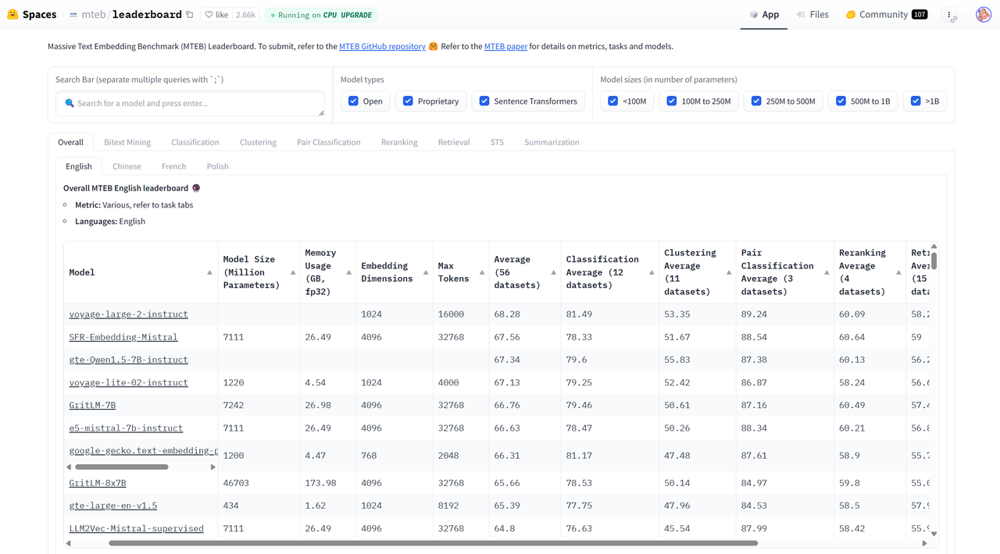

在[HuggingFace的排行榜](https://huggingface.co/spaces/mteb/leaderboard)上可以看到各种各样开源好用的embedding模型。在具体研究和工程问题的选择中，其实没有一个明确的好坏评价标准，适合自己的数据处理场景才是最好的。一个常见的方法是构造自己应用场景的专有评测集，然后分别尝试，量化的方式来评估分数最后选择。

todo：评测集构建的例子

### 4.3.2 数据预处理&#x20;

当我们拿到一篇或多篇文章，它们的格式可能是pdf，txt，doc甚至是ppt，我们往往会对其进行数据的预处理，来帮助后续流程中更好地让大语言模型和embedding模型来发挥作用。

机器学习中有一句深刻的名言：Garbage in，Garbage out。这不仅仅可以用于机器学习模型的训练，推理时过于混乱的原始信息也可能会极大程度地干扰模型的回复效果。因此，**数据预处理至关重要！**

数据处理的常用手段包含格式统一转换和数据清洗

数据读取 → 数据格式转换 → 数据清洗

Todo：流程图

* **数据读取**：从文件、数据库或API获取原始数据

* **数据格式转换**：将多样的数据统一转换成方便模型处理的格式（常用的为Markdown format）

* **数据清洗**：去除噪声、纠正错误、信息筛选等

TODO：一个pdf转成Markdown的代码示例

## 4.4 构建RAG应用&#x20;

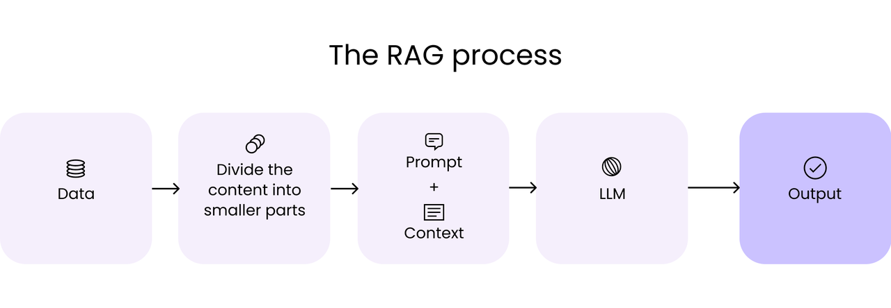

### 4.4.1 Basic RAG&#x20;

RAG，全称为 Retrieval Argumented Generation，检索增强生成。

大语言模型通过预训练阶段在海量文本上的自监督训练中获得了大量的人类知识，但是依然存在一些诸如时效性和幻觉的问题。而RAG正是为了补充并增强大语言模型的能力，使其尽量和现实世界对齐的一种技术路线。

一个最为简单朴素的RAG的思想为：我有一些文本数据包含了有用的信息，我想让大语言模型利用这些文本信息来生成回复，而不是直接输出答案，因此在原先的交互流程中，我们要将外部文本信息组成上下文合并到prompt中，交付给LLM，以此来达成**增强生成（Argumented Generation）**&#x7684;目的，就是这么简单！

这个时候聪明的读者可能就会发现了，欸，那 **Retrieval** 去哪儿了呢。这是一个很好的问题，如果我现在有一篇800字的作文或者5000字的论文，那我直接将其简单处理后合并进prompt中就可以了，如下所示：

但是，当我有100篇，甚至成千上万篇文章，以上亿token为单位的上下文长度时，很显然，会分分钟超出现在大语言模型所支持的上下文长度。此时，一个显而易见的解决方案便是：我只将我最关心的那一部分内容合并到 prompt 中交付给大模型。那如何才能知道大量文本中，哪些才是我最关心或者说和我的问题最相关的片段部分呢。欸，这就是 Retrieval 阶段的功能和作用。

CAMEL中对于Retrieval这一过程的功能实现在 `camel.retrievers` 中，具体参考https://docs.camel-ai.org/key\_modules/retrievers.html

根据匹配标准和算法的不同，常用的retriever大致可以分成两类，基于向量的稠密检索和基于关键词的稀疏检索，分别对应`camel.retrievers` 中的 `VectorRetriever` 和 `BM25Retriever`

`VectorRetriever`，向量检索器利用数据的向量表示，将数据（如文本、图像或其他形式的信息）转换为高维空间中的数值向量。

以下是向量检索的工作流描述：

* **分块**：对于大型文档或其他形式的数据信息而言，需要按一定的划分规则将其分解为较小的块

* **嵌入**：对于每一个分块，使用嵌入模型将文本转换为高维的向量形式。

* **存储**：这些得到的向量会被存储在数据库中。

* **检索**：当提出问题或进行查询时，嵌入模型会将问题转换为向量，然后在此向量数据库中搜索相似度高的匹配向量（这里一般会用余弦相似度来计算两个向量之间的距离），从而返回最相关的信息片段。

`BM25Retriever`，关键词检索器从结果而言是一样的，只不过是从更加稀疏的关键词的维度来对文本进行召回。通过关键词匹配的算法获取相似度高的文本片段，尽可能筛选出最相关的信息片段。

最后将最相关的信息片段像之前演示的那样合并到 prompt 中，交给大语言模型生成检索增强后的回复

接下来我们通过一个demo来学习以下如何快速搭建一个Basic RAG的系统

**读取示例数据：**

这里我们首先下载一篇CAMEL的论文作为文本示例，该PDF就是我们的原始文件

**实例化Embedding Model：**

这里使用 `VectorRetriever`，使用本地模型作为嵌入模型。

**向量嵌入和存储数据：**

接下来，我们将原始的文档读取，分块并且通过embedding模型生成向量表示和索引并将其存储在专门用来存储向量数据的向量数据库，VectorDB中。CAMEL框架中的 `process` 函数其本质上就是将**文件读取、切块、嵌入并储存**这个固定的处理流程统一封装成了一个方法，使得开发者更加方便快速的搭建RAG应用。

这里如果出现`UserWarning: Failed to partition the file: local_data/camel_paper.pdf`

`warnings.warn(f"Failed to partition the file: {input_path}")`需要补充这个环境：

**Windows**

**Mac和Linux**

**执行检索，查看效果：**

完成向量数据库的构建和存储后，就可以根据问题来进行检索。这里调用 `query` 方法执行查询

这里的参数`top_k=1`是指定检索器返回最相关的文本内容，同时还有一个相似度阈值参数`similarity_threshold`，其值介于0到1之间，默认值是`0.75`，从而确保检索到的内容的相关程度，可以根据自己应用场景的实际需求更改 `top_k 或 similarity_threshold` 值。&#x20;

`"What is CAMEL"`得到回复为

返回的字典包括：

* `similarity score` 相似性分数

* `content path` 内容路径

* `metadata` 元数据

* `text` 文本

当然，如果在实际应用中我们往往只关心模型的文本回复部分，我们可以在字典中取出`text`的值。

我们再尝试一个与论文内容无关的提问`"Compared with dumpling and rice, which should I take for dinner?"`：

我们可以看到在相似度阈值为0.8的情况下，检索器没有找到论文中与提问有关内容，这和我们的预期是十分符合的。

到目前为止，整个RAG的流程还没结束，因为我们实际上目前为止只是把最相关的内容检索了出来，还差最后一步，结合大语言模型的生成。

聪明的读者可能已经想到了，此时我们只需要实例化一个LLM或者Agent就可以了，CAMEL中的一个用于一般对话场景的Agent为 `camel.agents` 中的 \`ChatAgent\`。

更进一步我们可以将这一个步骤封装到一个函数里：

至此，恭喜您已经搭建了一个Basic RAG，接下来我们将介绍更多RAG中的小技巧\~

**作业**：在自己准备的数据集上尝试搭建一个RAG应用并测试一下效果，如果效果不理想，是否有改进的方法呢？

### 4.4.2 Rewriting&#x20;

带着上一章作业的问题来看接下来的章节会更有收获哦！

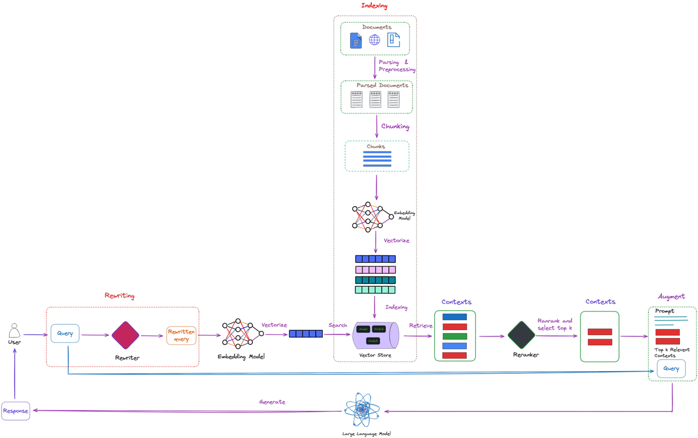

在实际的应用中，很多时候我们可能会发现，用户的提问是不一定准确的，比如存在错别字，语义顺序颠倒等情况，甚至有时候用户对于自己的Query究竟要如何表达也是模糊不清的，而阅读并实践了上一章节的读者可能会有一个直观的感受，就是Query不仅会作用在检索的部分，还会作用在最后生成回复的部分，简而言之，Query的质量可能会极大程度地影响整个RAG系统的表现和性能。

因此在这里，我们尝试加入一个对于初始Query的改写或者澄清模块，又称为 `Rewriting` ，来尽可能提高Query的质量或增强之后RAG环节的质量。

我们不妨针对之前的分析来思考一下如何进行改写才能缓解之前提到的问题。

* **错字校正**：修正用户输入中可能存在的错别字的情况

* **句式调整**：重构Query来使得句子表达更加通顺严谨

对于这两个常规问题，我们可以使用LLM自我调整，通过提示词工程的方式令其自我优化提示词。

这里优化的轮数取决于需求，你可以让LLM不断优化，直到满足你的预期为止。

此外，Rewriting模块还存在很多其他优化技巧，比如：

* 子问题策略

也称为子查询，是一种用于生成子问题的技术。其核心思想是在问答过程中生成并提出与主问题相关的子问题，以便更好地理解和回答主问题。这些子问题通常更具体，可以帮助系统更深入地理解主问题，从而提高检索准确性和提供正确的答案。

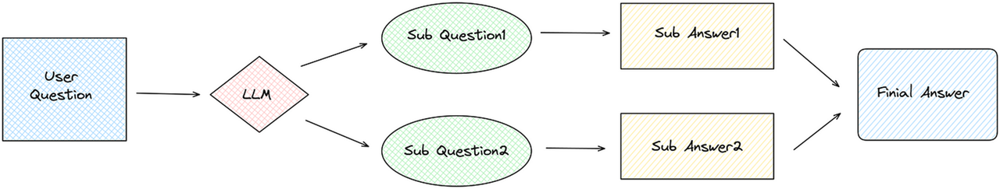

* HyDE 查询转换

论&#x6587;**「Precise Zero-Shot Dense Retrieval without Relevance Labels」** 提出了一种名为假设文档嵌入 (HyDE) 的方法。HyDE (Hypothetical Document Embeddings) 的本质是使用 LLM 为用户查询生成假设文档。这些文档是根据 LLM 本身的知识生成的，可能包含错误或不准确之处。但是，它们与 RAG 知识库中的文档相关联。然后，通过使用这些假设文档来检索具有相似向量的真实文档，从而提高检索的准确性。

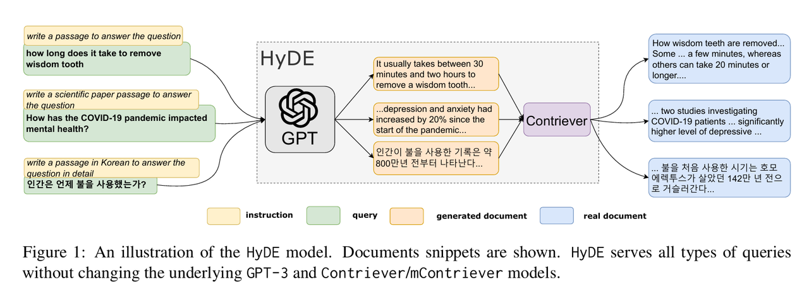

我们可以对比一下加入了Rewriting之后的回复生成效果和Basic RAG的结果

TODO：对比效果

作业：你还知道其他Rewriting的优化技巧和方法吗？能在CAMEL框架中实现上述的两个

### 4.4.3 Rerank

之前我们提到了可以通过向量和关键字等多种方式和不同的维度来进行检索，为了检索这一步结果的精确性和强相关性，我们往往会引入Rerank这一模块来对多路召回(多路指的是向量相似度，关键字匹配，基于规则的匹配，甚至结构化搜索等多种方式并行召回，往往召回的片段结果数量加起来比较多)的文档片段结果进行重排。因为数量越多，召回的内容相关度越可能存在问题，多数情况下score最高的片段相关度没问题，但是top2-5及往后的相关度就很随机了，这会对最终生成效果造成影响。

Rerank模块对初步检索结果重新排序可以简单概括为以下几步：

1. **初步检索**：获取（多路召回）初始文档片段

2. **特征计算**：评估每个文档的相关性

3. **重新排序**：根据特征得分排序

4. **选择最佳结果**：根据重排结果倒序排列，取前TOP-K个作为最终的最相关结果交给LLM生成回复

为了量化我们系统的有效性，我们主要依赖于两个被广泛接受的指标：**命中率(hit rate)&#x20;**&#x548C; **平均倒数排名(MRR)**。

**命中率(Hit Rate)：**

Hit rate计算在前k个检索文档中找到正确答案的查询比例。简单来说，它是关于我们的系统在前几次猜测中正确的频率。

**平均倒数排名(MRR)：**

对于每个查询，MRR通过查看排名最高的相关文档的排名来评估系统的准确性。具体来说，它是所有查询中这些秩的倒数的平均值。因此，如果第一个相关文档是顶部结果，则倒数排名为1; 如果是第二个，倒数是1/2，以此类推。

如果还没有太懂，不要紧，我们可以通过BAAI提供的Evaluation测评的结果来直观的理解，简单而言对于同一个embedding model，使用不同的rerank model，mrr和hit rate指标的分数越高，意味着效果越好！https://huggingface.co/BAAI/bge-reranker-v2-minicpm-layerwise

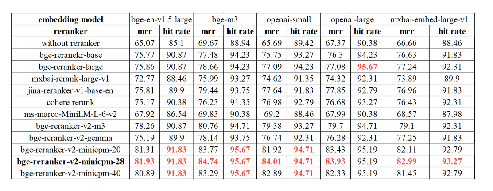

我们这里使用比较经典的RRF（Reciprocal Rank Fusion）算法来实现一个reranker。

倒数排序融合(RRF) 是一种将具有不同相关性指标的多个结果集组合成单个结果集的方法，不同的相关性指标也不必相互关联即可获得高质量的结果。该方法的优势在于不利用相关分数，而仅靠排名计算。

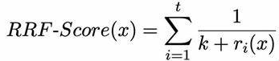

我们可以进一步对比一下加入了ReRank之后的回复生成效果和Basic RAG的结果

TODO：对比效果

作业1：思考CAMEL框架中是否集成了reranker，能够通过调用API或本地部署reranker模型来快速将rerank模块集成到RAG应用中

https://github.com/camel-ai/camel/blob/master/camel/retrievers/cohere\_rerank\_retriever.py

作业2：使用大语言模型和简单的提示词工程在CAMEL框架下实现一个ReRanker，达成重排的效果（灵感来自CAMEL Shanghai Hackathon韬子哥QAQ）

https://github.com/fengju0213/NavigatorAI/blob/main/2Travel\_information\_generation.py

***

## 4.5 RAG应用的评估

### 4.5.1 如何评估一个RAG应用

RAG（检索增强生成）是一种结合了信息检索和自然语言生成的技术，广泛应用于知识问答、客户服务等领域。要实现高质量的RAG应用，必须对其进行全面的评估和优化。本文将从以下几个方面展开介绍：如何评估RAG应用，如何评估及优化检索模块，以及如何评估及优化生成模块。

评估RAG应用需要综合考虑：

* **检索性能**：检索的准确率和召回率

检索模块决定了从知识库中找到的文档质量，是RAG应用的基础。主要评估指标包括：

* 准确率（Precision）：检索结果中相关文档的比例。

* 召回率（Recall）：所有相关文档中被检索出的比例。

* F1值：准确率和召回率的调和平均值。

* **生成质量**：回答的准确性、流畅度和相关性

* 准确性：回答是否正确。

* 流畅性：语言是否自然。

* 相关性：回答是否与问题紧密相关。

* **用户体验**：响应速度、交互友好性

用户体验评估主要关注应用的交互友好性，包括：

* 响应速度：回答的生成时间。

* 交互性：系统界面和交互设计是否直观。

* 稳定性：系统是否可靠，无明显错误。

***

### 4.5.2 评估及优化检索模块

**评估检索模块的方法**：

* **指标评估**：使用准确率、召回率、F1值等指标

评估检索模块时，常用以下指标：

* 准确率：衡量检索结果的相关性。

* 召回率：衡量检索结果的覆盖范围。

* F1值：综合考虑准确率和召回率。

**评估检索模块**

这里可以使用我们用LLM生成的一个示例md文档作为我们要检索的文档，使用本地的embedding模型和向量检索器。

在这里我们设置一些问题和我们预期的标准答案。

之后，我们定义我们的评估指标，我们计算检索出的结果和我们预期结果之间的余弦相似度，并且认为超过一定范围时检索的结果是符合预期的。

下面我们执行评估：

通过以上的步骤，我们可以完成一个简单检索模块的评估。下面我们来看一下如何优化我们的检索模块。

首先我们会发现在上面第三条检索的结果其实是涵盖了我们的预期结果的，但是由于我们使用的是基于TF-IDF的余弦相似度。导致了其得分较低

首先，我们简单介绍一下TF-IDF的基本原理和它在相似度计算中的应用。TF-IDF（词频-逆向文件频率）是一种用于信息检索和文本挖掘的常用加权技术，用于评估一个词在文档中的重要程度。其核心思想是：如果某个词在一篇文档中出现的频率高，并且在其他文档中很少出现，则认为该词具有很好的类别区分能力。

这种方法在我们第三条结果出现的问题是：

**忽略语义信息**：TF-IDF基于词频统计，无法捕捉词语之间的语义关系。例如，“汽车”和“车辆”在语义上是相近的，但TF-IDF会将其视为完全不同的词。

而且预期的结果和检索到的结果字数差距较大，导致两条结果的在基于TF-IDF的余弦相似度下相差较大。这里我们可以尝试使用Embedding模型来将结果转成向量之后再计算余弦相似度。它的特点如下：

**优点**：精准捕捉语义和语境。
**缺点**：计算资源消耗大。

然后再重新运行一下评估函数：

可以发现，这次评估的结果更加符合我们人类的标准。

另外我们可以发现，我们每次检索到的内容其实完全一样，这是因为VectorRetriever会默认将文档按照500字为间隔来划分，我们将这里我们可以调整一下chunk的大小，之后重新划分文档：

然后再次检索：

可以发现效果又更近了一步。

更多的调整方向可以参考以下几点：

* **参数调整**：优化嵌入模型和检索算法的参数

优化嵌入模型和检索算法的参数，例如：

* 调整嵌入向量的维度。

* 优化检索的相似度计算方法（如欧几里得距离、余弦相似度）。

* 在自身场景下微调嵌入模型通过效果是明显的

* **数据增强**：扩充知识库，提高覆盖面

通过扩充知识库提高覆盖面，例如：

* 添加更多高质量的知识数据。

* 利用数据增强技术生成多样化的知识表达。

* **检索策略优化**：

* 分阶段检索

* 混合检索(如TF-IDF + 语义模型)

* 实时反优化

### 4.5.3 评估及优化生成模块

优化生成模块的方法：

* **质量评估**：使用BLEU、ROUGE等自动指标和人工评估

生成模块的评估可以分为自动评估和人工评估：

* 自动评估：使用BLEU、ROUGE等指标衡量生成文本的质量。

* 人工评估：通过专家或用户打分，评估文本的准确性、流畅性和相关性。

* **上下文增强**：提供更丰富的上下文信息

* 为生成模型提供更丰富的上下文信息，例如问题背景或用户历史记录。

代码示例：以下展示了如何评估生成模块的回答质量。

## 4.6 Graph RAG应用实战&#x20;

### 4.6.1 Graph RAG以及与传统RAG的优劣

Graph RAG 是将知识图谱（Knowledge Graph）引入检索增强生成（RAG）框架的一种扩展形式。它利用结构化的知识显式表示实体及其关系，从而显著提升系统的推理能力和回答准确性。相比于传统 RAG 仅基于向量检索的机制，Graph RAG 在复杂任务中具有独特的优势。

**优点：深度理解**：通过显式的实体和关系表达，Graph RAG 能够支持复杂的问答和逻辑推理。**高准确性**：由于知识图谱中知识的结构化表示，减少了生成模型出现幻觉现象（hallucination）的可能性。

**缺点：构建复杂**：知识图谱的构建和维护需要大量时间和资源投入。**灵活性有限**：对于实时更新和动态信息支持较差，难以应对快速变化的场景。

### 4.6.2 图数据库介绍

图数据库是 Graph RAG 的核心组件，用于存储和管理知识图谱。它能够高效处理复杂的关系查询，同时提供灵活的结构和强大的查询能力。

**特点：高效的关系查询**：图数据库优化了实体与实体之间关系的查找和操作，性能优于传统关系型数据库。**灵活的结构**：支持动态添加节点（实体）和边（关系），能够应对多样化的数据变化。**强大的查询语言**：如 Neo4j 的 Cypher，方便用户编写复杂查询逻辑。

**常用图数据库：**

* **Neo4j**：功能强大，易于使用的企业级图数据库。

* **JanusGraph**：分布式的开源图数据库，适合大规模图数据管理。

### 4.6.3 构建三元组并上传图数据库

知识图谱的核心是三元组（Triplets），由节点、关系、属性组成：

**节点（Node/Entity）**：表示实体，是图中的顶点

**关系（Relationship/Edge）**：表示实体之间的联系，是图中的边

**属性（Property/Attribute）**：节点或关系的特征描述

例如我们的有一段文本：

我们可以从中找出CAMEL、DataWhale等等这些节点，那么CAMEL和人工智能技术的发展之间的关系可以表述为：CAMEL"致力于"人工智能技术的发展。而CAMEL的属性可以为"AI开源社区"。

1. **信息抽取**

之前我们可能通过一些NLP技术来做信息的抽取，现在我们可以直接使用LLM来完成这件事情。例如我们通过一些简单的prompt工程来完成这个目的：

我们首先通过一个prompt来定义来agent的功能，以及设置好我们案例文本。

可以看到，对于信息抽取这个任务，LLM能完成的相当出色。当然如果不想自己写prompt的话，CAMEL也有预设好的KnowledgeGraphAgent供我们一键调用，更改这里的参&#x6570;*`parse_graph_elements`*&#x53EF;以设定Agent返回的信息格式，False返回的是一个字符串，设置为True则返回一个自定义的GraphElement类：

* **上传数据库**

现在我们有了节点和关系信息，下一步就该把他们上传到数据库里了。

首先我们要初始化我们的图数据库，这里我们可以使用[Neo4j(点击跳转)](https://neo4j.com/):

CAMEL已经将上传到图数据这一个操作为我们一键集成，我们只需要使用一个简单的命令调用即可(需要搭配KnowledgeGraphAgent一起使用，设定parse\_graph\_elements=True)：

将提取的图信息添加到 Neo4j 数据库中：

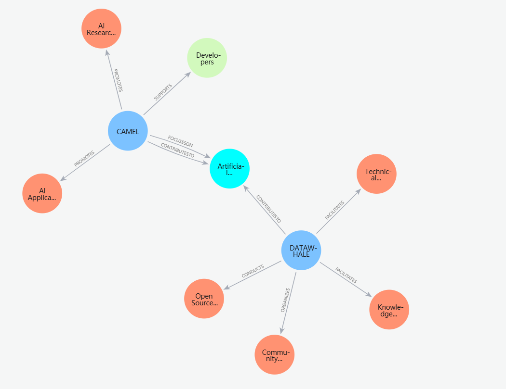

我们再回到neo4j就可以看到我们构建的知识图谱啦！

### 4.6.4 实践案例

在这个案例中，我们将展示如何以混合方式运行 RAG，结合向量检索和知识图谱检索，以查询和探索存储的知识。

首先我们使用本地部署的e5-large-v2作为我们的embedding模型(如果本地没有的话会自动下载)。

之后我们设置好我们想了解的内容，这里我们首先让它根据向量检索的方式来检索相关信息：

接下来，我们可以创建我们的知识图谱：

下面这个漂亮的图谱就是我们创建的结果啦！

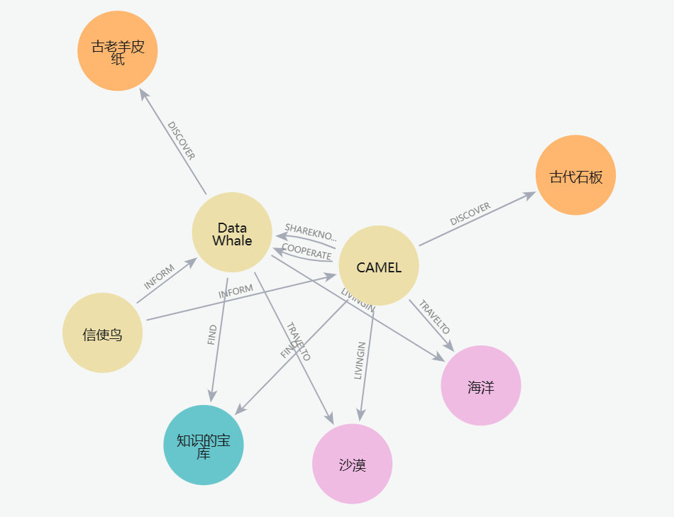

有细心的小伙伴应该发现了，我们在text中并没有给DataWhale或者CAMEL有'Organization'的描述，但是最后的结果却含有，这是因为在使用KnowledgeGraphAgent的run函数时会将检索的到的结果再经过一遍大模型的润色，我们如果想查询原始的数据可以使用neo4j的查询语句：

**匹配知识图谱存储中的实体：**

这样就可以检索出我们query对应的这些信息啦。

至此恭喜你学会了如何使用基础的向量检索和基于图数据库的检索！下面让我们看看，Graph还有哪些可以用的地方吧。

### 4.6.5 进阶案例

接下来的案例会演示如何利用设置和利用 CAMEL 的检索增强生成 （RAG） 与 Firecrawl 相结合，以实现高效的 Web 抓取、多代理角色扮演任务和知识图谱构建。我们将使用LLM 对 2024 年巴黎奥运会上的土耳其射击运动员进行全面研究。

在本笔记本中，您将探索：

* **CAMEL：**&#x4E00;个强大的多代理框架，支持 Retrieval-Augmented Generation 和多代理角色扮演场景，允许执行复杂的 AI 驱动任务。

* **Firecrawl**：一个强大的网络抓取工具，可简化从各种网页中提取和清理内容的过程。

* **AgentOps**：跟踪和分析 CAMEL Agent 的运行情况。

* **Qdrant**：一种高效的向量存储系统，与 Camel 的 AutoRetriever 一起使用，根据向量相似性存储和检索相关信息。

* **Neo4j**：领先的图数据库管理系统，用于构建和存储知识图谱，使实体之间的复杂关系能够高效映射和查询。

* **DuckDuckGo 搜索**： 在 SearchToolkit 中用于从 Web 收集相关 URL 和信息，作为检索初始内容的主要搜索引擎。

* **非结构化 IO：**&#x7528;于内容分块，便于管理非结构化数据以实现更高效的处理。

首先我要给所需要的工具设置好API 密钥

您可以到[这里](https://app.agentops.ai/signin)从 AgentOps 获取**免费的** API 密钥

您可以到[这里](https://www.firecrawl.dev/)从 Firecrawl 获取**免费** API 密钥

Firecrawl 是一个强大的工具，可简化网页抓取和清理网页内容的过程。在本节中，我们将从 CAMEL AI 网站上的特定帖子中抓取内容作为示例。

* **🛠️ 使用 CAMEL 的 RAG 和 Firecrawl 进行 Web 信息检索**

在本节中，我们将演示如何使用 Camel 的 RAG 模型从 URL 列表中检索相关信息。这对于聚合和分析来自多个来源的数据特别有用。

首先我们定义一个检索方法：

让我们通过收集有关 2024 年奥运会的一些信息来测试检索功能。第一次运行可能需要大约 50 秒，因为它需要构建本地向量数据库。

* 📹 **使用 AgentOps 监控 AI 代理**

CAMEL 的一个强大功能是它能够从文本数据构建和存储知识图谱。这很方便我们对数据中的关系进行高级分析和可视化。

首先我们定义一个函数用于处理输入文本以创建和提取节点和关系，并将其作为知识图谱添加到Neo4j数据库中。

然后我们设置我们的RolePlaying,AI 代理在其中交互以使用各种工具完成任务。我们将指导助理代理对 2024 年巴黎奥运会的土耳其射击运动员进行全面研究。

导入模块及定义我们的任务：

我们将为助理代理配置用于数学计算、Web 信息检索和知识图谱构建的工具。

开始我们的Agent交互。

**注意**：此会话大约需要 8 分钟。

***

# 5. 第五章 综合案例

在这一节中，我们将展示如何使用CAMEL框架来搭建一个简单实用的**旅游出行规划助手**。

## 5.1 **应用概览**

在大模型时代，代码能力基本已经不再是初学者想要开发AI应用的障碍，单纯地使用一些模型的Web端就可以搭建一些简单的应用，搭配一些AI编程工具可以让我们的开发效率更高，只需要写一些提示词就可以搭建一个简单的带有前端UI的应用。

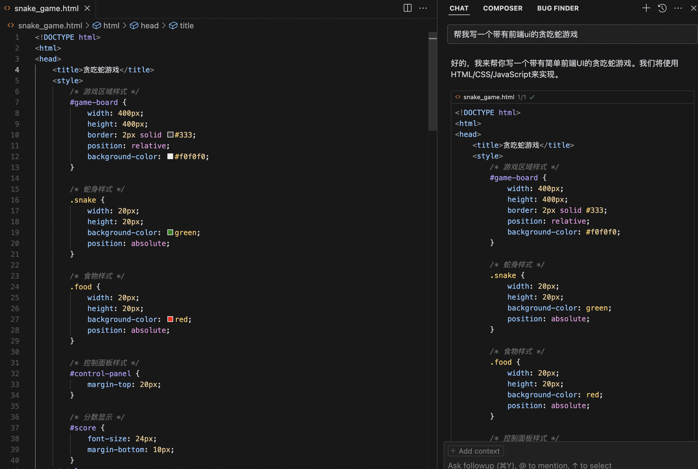

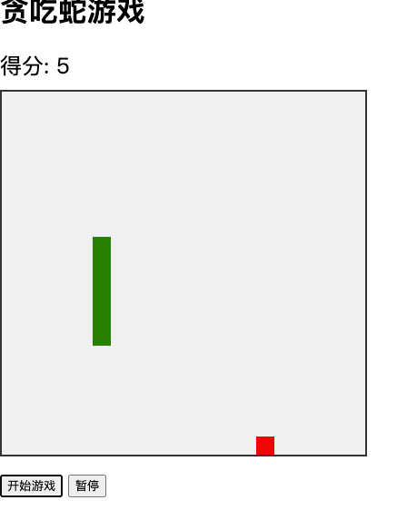

AI的写的代码直接复制就能跑！

得益于现在大模型的强大代码能力，我们可以将更多的精力放在我们的应用架构以及产品上，包括我们要实现的功能呀、架构设计、目标用户等等。能不能捕捉到用户的需求很重要，以什么形式满足？也就是说，现在的AI时代，产品思维对于应用开发者也是很重要的。

以下是我们使用CAMEL框架搭建一个真实可用的软件应用——NavigatorAI（旅游出行规划助手），其中使用到了非常多常见而实用的CAMEL模块和知识点。

> **特别注意**：NavigatorAI遵循[CC BY-NC](https://creativecommons.org/licenses/by-nc/4.0/)协议，仅供学习使用，不能商用！！！

### 5.1.1 目标和交互形式

首先明确我们的目标，项目的核心目标是实现一个智能化的旅游出行规划助手：用户**只需输入目的地和天数**，系统即可自动生成详细的旅游行程，包括每日活动安排、餐饮推荐、景点信息等。系统**还支持根据用户反馈动态调整行程，支持在线阅览和编辑**，同时提供多种格式（Markdown，HTML 或 PDF）的导出，方便用户保存或分享。这不仅提升了行程规划的效率，也能为用户带来更为便捷和专业的旅游体验。

根据目标我们可以设计出我们的整体应用架构图如下：

### 5.1.2 模块化设计

在现代软件开发中，一般会选择模块化的设计思路，旨在通过将系统分解为多个独立、可重用的模块来提升代码的可维护性、可扩展性和开发效率。模块化设计的核心思想是**解耦**，即通过清晰的边界和接口将系统的不同功能分离，使得每个模块可以独立开发、测试和维护，而不会对其他模块产生过多依赖。

因此通过模块化设计，开发团队可以更高效地构建复杂系统，同时降低长期维护的难度，可以帮助开发团队在短时间协同完成整个项目的开发设计和测试。

旅游出行规划助手NavigatorAI也采取了模块化的设计思想，整个综合应用可以分成四个子模块——

#### 5.1.2.1 **信息收集模块**

在该模块中，用户和**信息收集Agent**进行多轮往复的对话，直到Agent认为能够通过用户的表达和上下文提取出用户的目标出行城市和出行天数等关键信息，并将信息传递到下一个模块。&#x20;

#### 5.1.2.2 **攻略生成模块**

* **验证数据是否存在**：&#x20;

  * 如果数据库中存在对应的城市和天数的旅游数据，（即缓存命中），则直接加载复用数据。&#x20;

  * 如果数据库中没有查询到对应的信息，则调用Tool Calling中的搜索工具（Google Search 或 DuckDuckGo）进行实时的信息检索（检索的内容包括著名景点，当地美食，天气情况等数据，可以根据需要自由添加）

* **攻略初稿生成**：&#x20;

  * 接下来，**攻略生成Agent**会结合上述检索到的基础数据，按预先定义的默认格式生成 HTML 格式的详细行程攻略，包含每日的活动安排和推荐内容。&#x20;

* **格式转换**：&#x20;

  * 将生成的 HTML 导出为 PDF 格式，并在前端提供在线预览，方便用户进行下载/转发/保存/修改。&#x20;

#### 5.1.2.3 **反馈优化模块**

* **收集用户反馈**：&#x20;

  * 用户可以在前端预览中对生成的攻略初稿中的任意部分和内容进行评价，支持手动标记圈画需要优化的部分，这意味着我们接受反馈的形式是多模态的（图像理解+文字评述）。

* **使用反馈优化Agent进行意图理解并迭代式地调整攻略**：&#x20;

  * **反馈优化Agent**分析用户反馈并理解具体修改需求；&#x20;

  * 基于用户反馈，结合多模态能力和工具调用生成新内容并迭代式优化。&#x20;

* **输出最终攻略版本**：&#x20;

  * 根据用户确认的最终行程生成 PDF 文档。&#x20;

  * 将优化后的行程存入数据库以供未来复用。&#x20;

## 5.2 用户意图识别模块

该模块主要用于收集用户想要去哪，去几天的需求。我们可以通过一个合适的system prompt来实现，为了后续在软件开发中的前后端分离的设计，我们还需要进一步通过flask将该模块封装成一个本地服务——

这个模块运行之后会在本地5001端口启动一个服务，我们可以通过请求这个服务来和模块中的**信息收集Agent**进行多轮交互

使用Python requests库的示例代码

使用curl的示例命令行，这次我们不说清楚需求试试：

通过上述两个测试的示例可以观察到**信息收集模块**的核心功能会让我们在信息表述不全的情况下自主的分析问题并引导提示我们补充行程天数，有的小伙伴可能会觉得，根本没必要这样做呀，直接在开始界面设置弹窗让用户输入城市和天数不就行了，其实这个方案我们也考虑过，这样确实更方便快捷，而我们在方案中特意添加了这个模块是为了考虑到后续可能有更多的交互空间的拓展，比如情感陪伴等。当然，适合自己的方案就是最好的！Enjoy！

## 5.3 旅游信息检索

旅游信息检索是系统中实现数据获取和处理的关键环节，负责根据用户输入的目的地城市和出游天数，动态获取并生成高质量的旅游数据。

模块的工作流程分为以下几个阶段：首先，对用户输入的信息进行标准化处理，将城市名称和时间信息改写为适合搜索引擎的查询模板（query）。随后，系统调用 **Google Search API** 进行景点和美食信息的文本检索，包括景点描述、距离、推荐美食等详细内容；同时，为了补充图片资源，模块还调用 **DuckDuckGo 搜索引擎**，专注于获取高质量的景点和美食图片链接。

在数据检索完成后，模块进一步利用大语言模型（LLM）对初步搜索结果进行智能解析与重排序（rerank），从相关性和用户需求角度优化数据质量，确保信息全面、准确、优先级清晰。经过优化后的数据会以结构化的形式存储到数据库中，包含每个景点和美食的名称、详细描述、推荐理由以及图片 URL。

同样的，我们在本地的5002端口启动了一个服务，我们使用requests库来调用测试一下效果：

这个模块用于搜集和整理旅游信息。信息主要包括旅游的一些景点、美食信息及对应图片的url，以便于我们后面将他们转成图文攻略。

在大语言模型的应用开发中，我们常常使用JSON作为中间数据的逻辑保存格式，因为交互方便，很好地表示结构化的信息且方便人类阅读和理解。

以下是生成的三份参考结果

命名逻辑是 {地点}+{时间}+旅游信息.json

## 5.4 攻略生成模块

这个模块实现了一个旅行行程规划服务，主要流程如下： &#x20;

核心思路是通过前端传来的城市和出游天数信息，先在本地数据库中查找是否已存有相应的旅游数据（例如景点、美食等），如果没有就自动检索和生成对应的旅游信息并存储起来。随后，后端会使用 CAME 库与 Qwen2.5-72B-Instruct 模型，结合一段包含行程规划规则的系统消息，指导大模型生成完整的多日行程安排。为了让结果在前端方便查看，代码会将模型给出的文本格式化成 HTML，并在必要时将其中的图片链接转换成 `` 标签，使用户可以直接预览行程攻略页面。如果用户想要下载，后端还可以将该 HTML 转换成 PDF 供导出。当用户对当前结果不满意时，可以再次与大模型交互，通过多轮对话来动态调整和优化最终的旅行方案。整个过程如图所示：当有城市与天数信息输入时，系统先判断本地库中是否存在可用数据；若存在则直接调用大模型生成行程，若不存在则先行检索并存储数据后再进行行程生成；最后通过前端界面查看生成的 HTML 或者 PDF，如果用户仍需修改，则再次通过大模型进行迭代。这样就完成了一套从检索数据到生成和展示定制化旅游攻略的完整流程。

这里我们使用另一种方式来测试服务接口，熟悉软件开发的小伙伴应该用过Postman

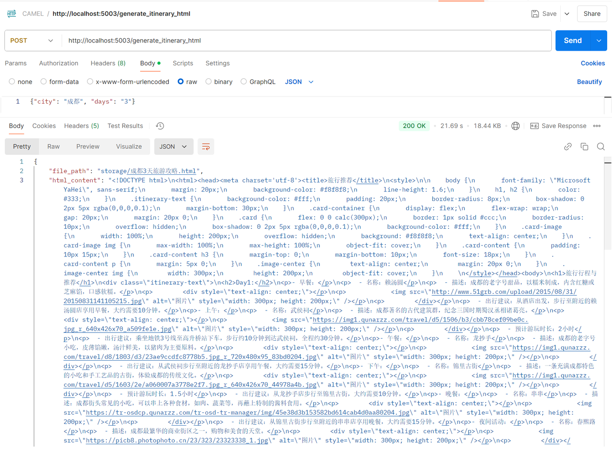

我们在postman中使用Post请求发送一份数据来模拟前端的请求，从而得到后端返回的数据，即html\_content，然后由save逻辑保存到本地的storage数据库中

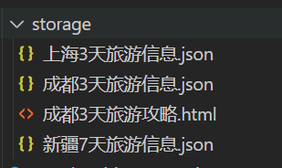

此时其实我们已经得到了一份不错的可展示的攻略了，在本地的浏览器中双击即可打开并看到渲染效果

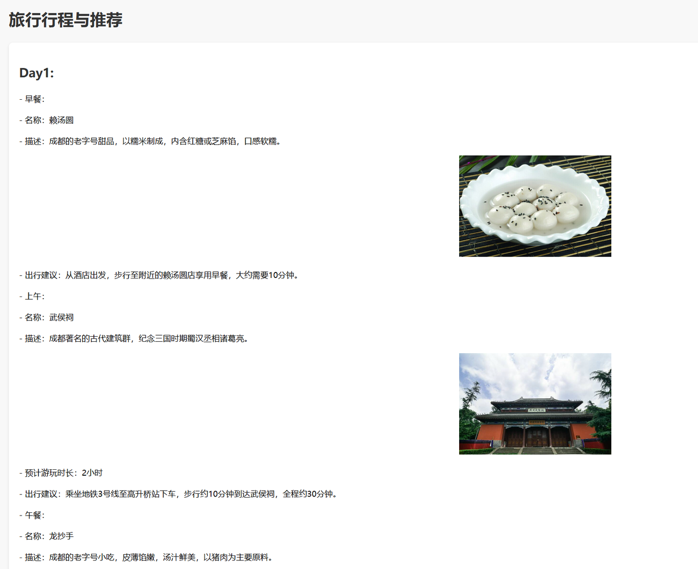

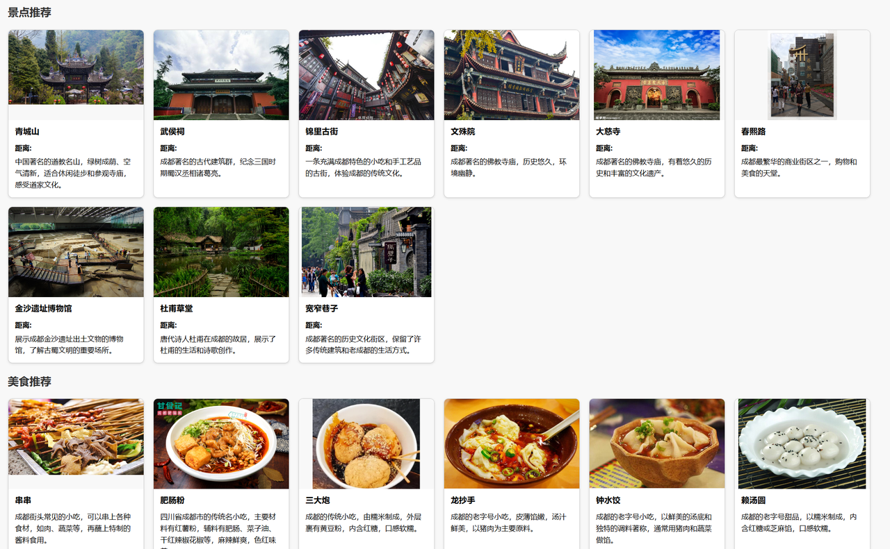

最后我们再把HTML转成在任何显示设备上都一致的PDF格式，保证了攻略的统一性，不必担心错位，换行等一系列问题。

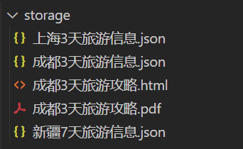

## 5.5 反馈优化模块

反馈优化模块需要使用到具备多模态能力的大语言模型，因此需要大家再申请一个具有图像理解能力的大模型（这里我们以gpt-4o演示），CAMEL中具体的支持列表如下：

在反馈优化中，我们所有的操作都是基于PDF的，虽然存在中间过程，但是对于用户来说是无感知的。具体而言，对于一个PDF，我们会先识别出用户做过标记圈画的部分，然后将其所在的整页转化为image的形式作为输出源的一部分交给有多模态理解能力的**反馈优化Agent。**

**反馈优化Agent**能够很好的理解用户的修改提示和意图，在HTML层面做出修正，重复之前的旅游信息检索和攻略生成模块，完成闭环，从而迭代式的优化旅游攻略，直到用户满意为止。

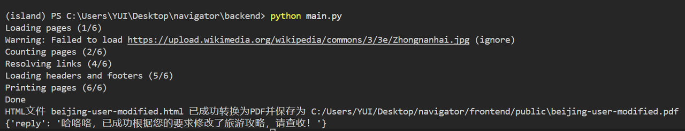

在线编辑PDF，调整需求：
需求一：红色部分帮我替换成中南海

需求二：文案帮我调整成小红书风格

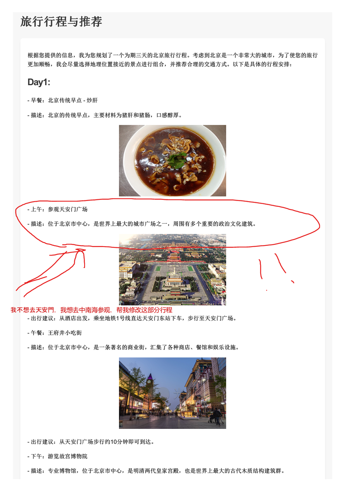

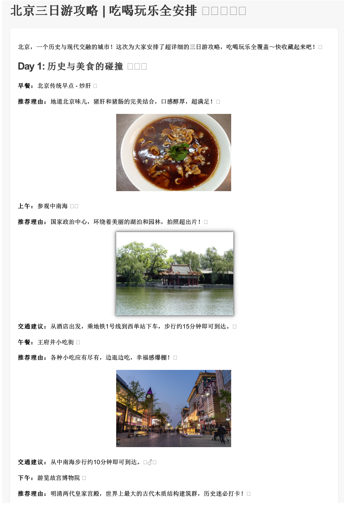

观察到文案风格确实更加活泼，且红圈部分正确修改成了中南海和配图也十分吻合。

## 5.6 搭配前端食用

综合案例中为了尽可能让大家直观的感受到基于CAMEL框架的Agent产品开发的乐趣，我们还为大家准备了精美的前端，搭配之前的几个后端模块一起构成我们的NavigatorAI旅游出行规划助手应用。

这里只给出一些功能上的描述和简介，前端的具体框架和原理不属于本次我们教程的讨论范围，感兴趣的同学可以自行拓展\~

### UI在线交互模块

UI 在线交互模块是系统中与用户交互的关键部分，旨在通过直观的界面实现对生成行程内容的在线预览、编辑和反馈。用户可以在界面中直接查看生成的 PDF 文档，实时圈选、标注或输入修改意见，系统会根据用户提供的反馈动态调整行程内容。

左右两边的侧边栏分别是历史记录+设置栏和文件交互栏，两侧都支持展开和隐藏，非常便捷和人性化。

支持昼夜模式切换

> Dark mode

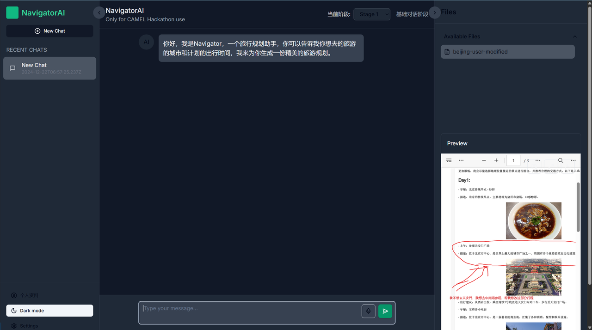

> Light mode

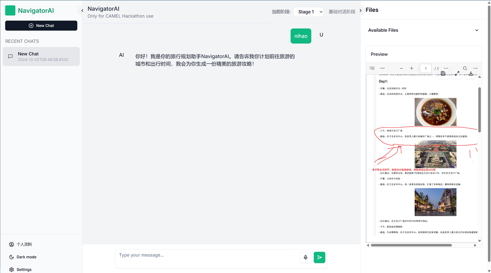

1. **PDF 在线渲染** &#x20;

   * 将生成的行程文案以 PDF 格式直接嵌入到界面中，用户可以实时浏览内容。

   * 支持高质量的 PDF 渲染，确保用户能直观查看文字、图片和布局。

2. **动态交互编辑** &#x20;

   * 用户可以直接点击 PDF 文档中的任意内容进行标注或编辑。

   * 提供圈选工具，允许用户高亮文中需要修改的部分并附加文本说明。

   * 输入框支持对具体段落、景点描述或图片的修改建议。

3. **反馈与动态调整** &#x20;

   * 用户的修改意见将自动传递给大模型（LLM），系统分析反馈并对行程内容进行优化。

   * 支持多轮交互，用户可以反复调整文案，直至满意为止。

4. **实时预览** &#x20;

   * 调整后的内容会立即在界面中重新渲染，用户无需等待即可看到更新后的 PDF 文档。

   * 保持高效的交互流程，提升用户体验。

### 个人信息输入模块

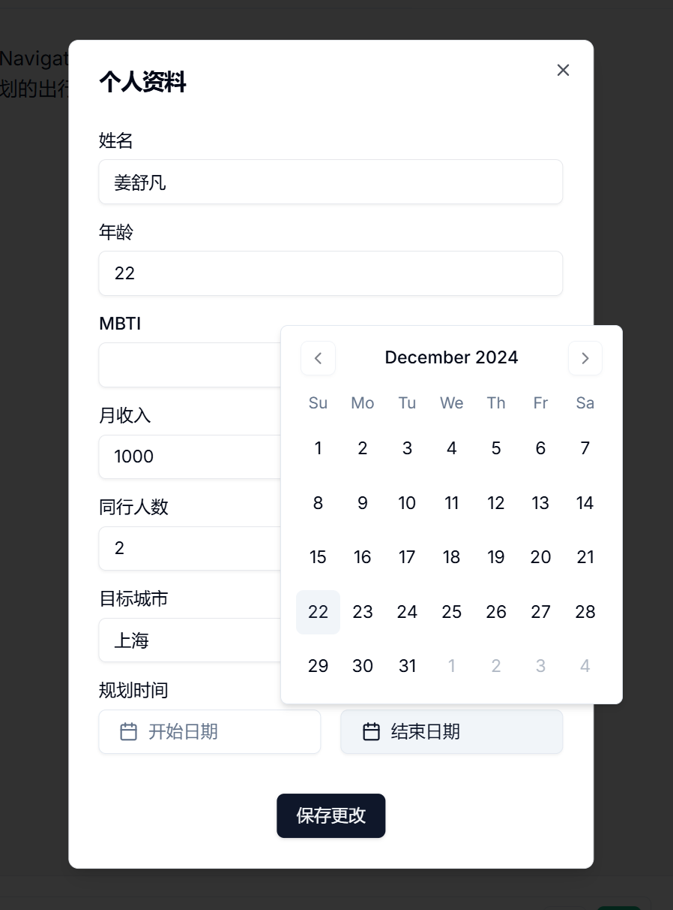

个人信息输入模块是系统的重要组成部分，用于收集用户的基础信息以便生成更符合个性化需求的旅游行程。通过直观友好的界面设计，用户可以快速填写相关信息，模块根据这些输入数据定制化生成行程内容。

1. **用户基础信息录入** &#x20;

   * 支持用户输入包括姓名、年龄、MBTI（个性类型）、月收入等个人信息。 &#x20;

   * 数据用于优化旅游规划的推荐内容，例如推荐适合预算的活动和美食。

2. **出行偏好设置** &#x20;

   * 用户可以指定目标城市、同行人数以及出行的具体日期（开始日期和结束日期）。 &#x20;

   * 系统会根据这些信息计算出行程天数并匹配对应的景点和活动。

3) **交互式日历组件** &#x20;

   * 嵌入式日历设计，方便用户快速选择出发日期和返回日期。 &#x20;

   * 界面清晰，操作直观，同时支持日期范围校验，避免选择无效的时间范围。

4) **即时保存与更新** &#x20;

   * 提供“保存更改”按钮，允许用户修改输入信息并实时保存，确保数据更新准确。 &#x20;

   * 便捷的数据交互设计减少了用户的操作负担，提高了使用效率。

### 模型选择

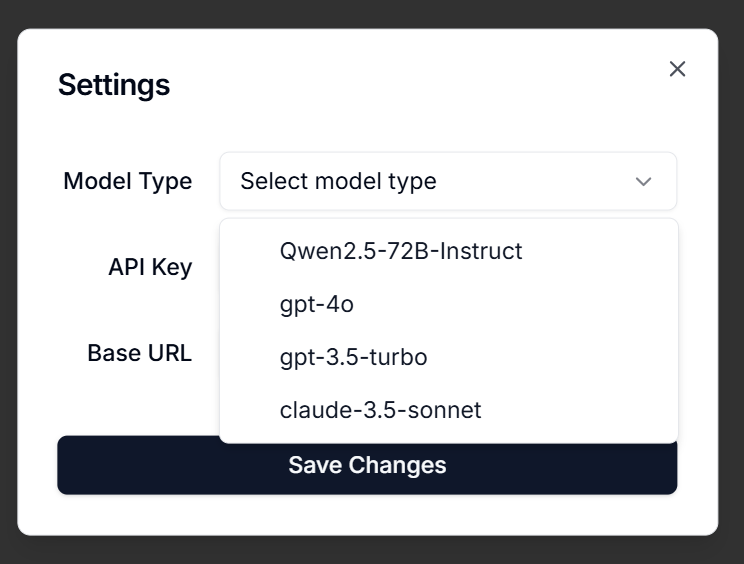

我们的模型选择模块是一款针对多语言模型应用需求设计的配置工具。用户只需要简单几步，就可以在界面中切换模型，并快速完成初始化配置，**随时切换和管理多种主流模型**。

下拉菜单集成了目前支持的模型：

* **Qwen2.5-72B-Instruct**：通义千问团队的最新开源模型。（综合案例中的大部分演示是基于此API）

* **gpt-4o**：拥有强大的推理能力和多模态能力，能够处理一系列复杂任务。

* **gpt-3.5-turbo**：轻量级、响应快。

* **claude-3.5-sonnet**：适合对话生成和自然语言理解的场景。

> **再次提醒**：NavigatorAI遵循[CC BY-NC](https://creativecommons.org/licenses/by-nc/4.0/)协议，仅供学习使用，不能商用！！！

***

# 6. （以下内容为后续规划，现供参考）第六章 CAMEL的特色功能——数据合成

## 6.1 前言

在大模型时代，高质量数据正在成为越来越重要的一部分，然而通过人工的标注的方式获取数据的成本太高，并且真实世界的数据正迅速耗尽，于是就有了使用AI来合成数据的方法，下面我们来介绍如何使用CAMEL帮助我们合成SFT数据。

CAMEL 和 Unsloth 是一对出色的搭档。在此章节中，我们将两者结合起来，以训练模型精通页面上的内容。您将学习如何使用 CAMEL 进行数据生成、如何训练以及如何运行模型。

**Unsloth 需要 GPU 环境，要在您自己的计算机上安装 Unsloth，请按照[此处](https://github.com/unslothai/unsloth?tab=readme-ov-file#-installation-instructions)的安装说明进行操作。**

以下流程，笔者使用移动版Nvidia GTX4070显卡，显存为8GB。

## 6.2 CoT数据生成及模型微调

设置好后面用于进行数据合成的LLM

**数据准备**

我们需要准备一份Q\&A 数据，这里我们采用json格式的QA数据，格式如下：

`''' { “问题1”： “答案1”， “问题2”： “答案2”， ... }‘’’`

可以发现我们的示例数据是单纯的一问一答的数据，并没有中间的思考过程，这就让人没有那么容易相信模型的回答是真正准确的，就和我们解题的时候，没有中间过程，只有最后的结果的话通常不太会让老师相信我们是真的会这套题。我们现在让模型帮助我们补上中间的思考过程。

可以发现，Agent自动帮我们补全了中间过程，这里我们可以简单了解一下`CoTDataGenerator`的工作原理，这个类实现了生成 Chain of Thought (CoT) 数据的功能，主要通过以下几个关键机制：

* **双代理系统**

使用 generator\_agent 生成答案

使用 verifier\_agent 验证答案

也可以使用单一代理同时负责生成和验证

* **蒙特卡洛树搜索 (MCTS)**

在 solve\_question 方法中实现

通过多次迭代搜索最佳答案

每次迭代都会生成新的答案并评估其质量

* **二分查找错误定位**

通过 binary\_search\_error 方法定位答案中的错误位置

可以精确找到答案中出错的部分

生成 CoT 数据的具体流程如下：

1. 初始化时传入预定义的正确答案 (golden\_answers)

2. 对于每个问题：

   先尝试直接生成答案

   如果答案不正确，则启动 MCTS 搜索

   在搜索过程中不断评估答案质量

   使用二分查找定位错误

   基于正确部分生成新的解决方案

3. 将最终解决方案存储在 solution\_tree 中

**将生成的答案导出到 JSON 文件，并将其转换为 Alpaca traing 数据格式**

我们可以将其封装成函数：

**将数据上传到 Huggingface**

这里定义了一个函数 upload\_to\_huggingface 将数据集上传到 Hugging Face。该脚本是模块化的，帮助程序函数处理特定任务，例如数据集名称生成、数据集创建、元数据卡创建和记录添加

**配置 Huggingface 的 Access Token**

我们可以到[这里](https://huggingface.co/settings/tokens/new?tokenType=write)从 Huggingface 获取 API Key

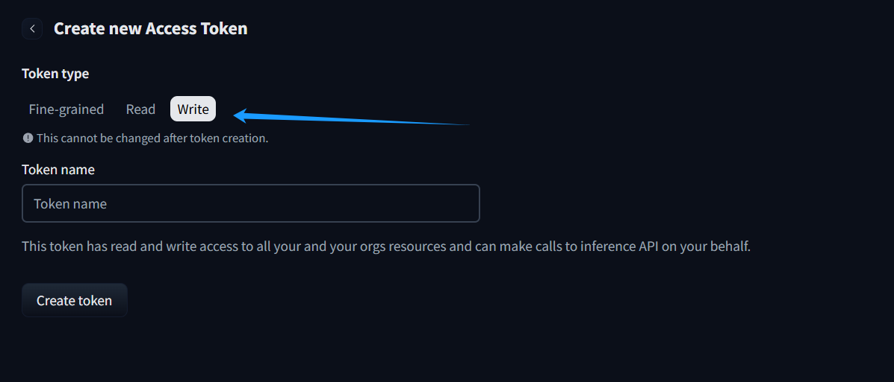

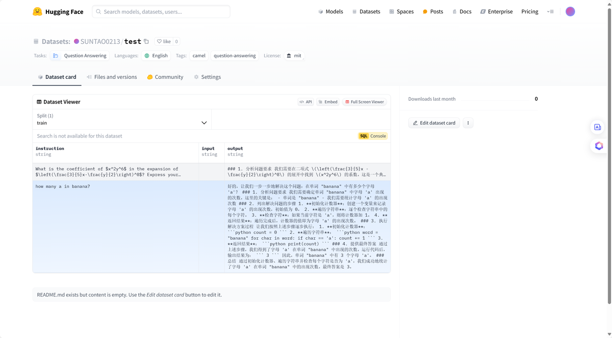

我们可以在自己的主页看到自己上传的数据集。

***

**配置 Unsloth 环境**

这里我们准备用一个Qwen2.5-1.5B的模型来进行微调

**将 CoT 数据转换为符合 SFT 标准的训练数据格式**

现在我们准备训练模型 让我们使用 Huggingface TRL 的 ！更多相关文档在这里： [TRL SFT 文档](https://huggingface.co/docs/trl/sft_trainer)。我们执行 60 个步骤来加快速度。

**开始模型训练**

# 附录

## 支持的模型

下表列举了Camel目前支持的模型

# **结语**

恭喜您！在阅读到这里时，您已经掌握了 CAMEL-AI 应用开发框架的基础知识，并能够利用 Agent 实例在您的代码逻辑中执行复杂的任务。此外，您还可以尝试将 Agent 实例整合到更复杂的工作流中，或实现 Agent 实例之间的协同工作。

以下是我们精心挑选的几个案例，供您进一步学习。这些案例旨在展示如何在特定业务场景中运用 CAMEL 框架实现复杂的业务流程。

* 多智能体 Agent 与定制化数据结合，解决特点领域专家问题

  &#x20;参考: https://github.com/camel-ai/camel/wiki/RAG-Cookbook

* XXXX

* XXXX

同时，我们诚挚地邀请您继续关注我们的文档更新。在未来的文档中，我们将对 CAMEL 框架的高级特性进行深入探讨，包括如何使用 Workflow 组织和编排 LLMs 应用工作流程、如何理解和开发框架的插件能力，以及如何构建多 Agent 协作方案等。

祝您学习愉快，学有所获，期待下次的相聚！

## 关注我们

请扫描下方二维码，关注我们的公众号：

Datawhale

CAMEL-AI

##

***

